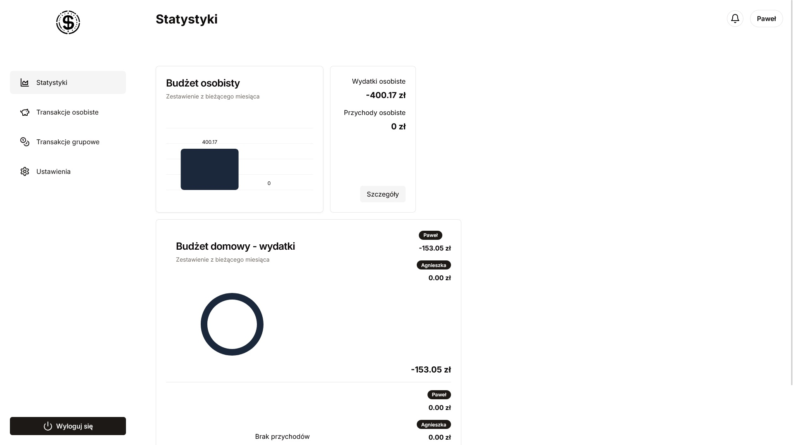
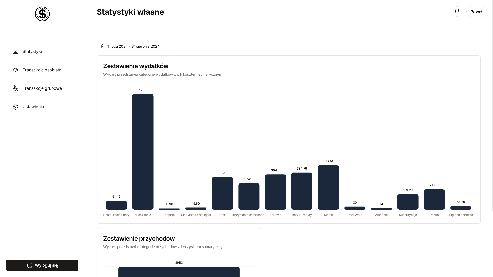
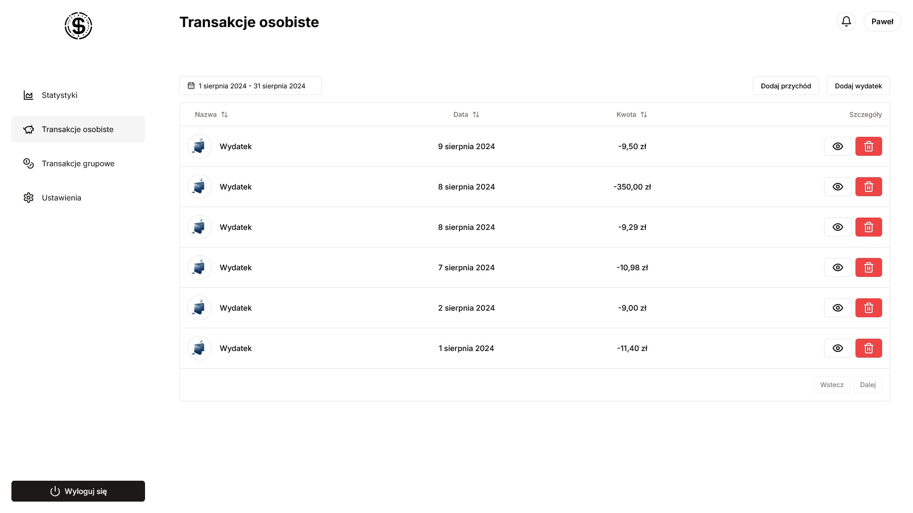
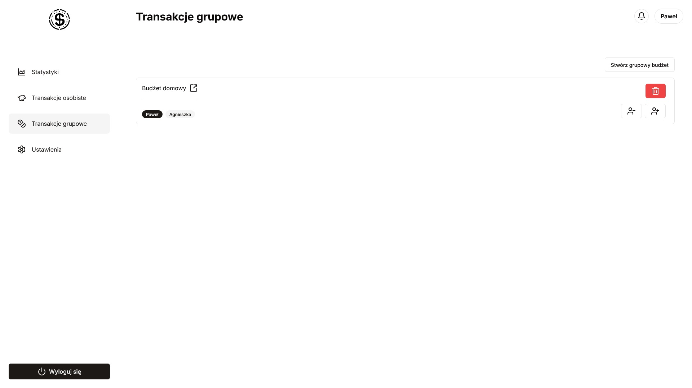

# iSave App 
**a simplified expense report app based on your receipts (OCR and AI related)**

Currently supports Polish language only (original users are my family).  
More than a dozen default expense and income categories have been introduced.  
Ability to create multiple group budgets with other users.  
Read receipt images and convert to text inside the app (limit of 10 queries per day).  

## Test access
email: test@test.com  
password: test  
**[Navigate to the application](https://isave-ten.vercel.app/)**

## Features
* Creation of multiple group budgets
* Controlling access to data based on roles
* Creation of transaction statistics based on a selected date range
* Tracking of personal expenses
* Conversion of images to text
* ChatGPT support for reading text for specific expenses
* Adding, editing and deleting transactions
* Account activation via a link on the email address provided during registration

## Support for the development process
* Split into development and production environments.
* Application monitoring in Sentry
* Unit and e2e tests
* Automatic application build to Vercel via github pages

## Technology Stack
* Next/React
* NextAuth
* TypeScript
* MongoDB
* Prisma
* Shadcn/ui
* Axios
* Nodemailer
* Tesseract
* Tailwind
* openAI
* Zod
* Vitest
* React Testing Library
* Playwright
* Sentry

## Further development
* Test completion.
* Component duplication refactoring
* Improving UI
* Change to light/dark theme
* More account management features in settings
* Better user experience on mobile
* Data validation in the backend using Zod