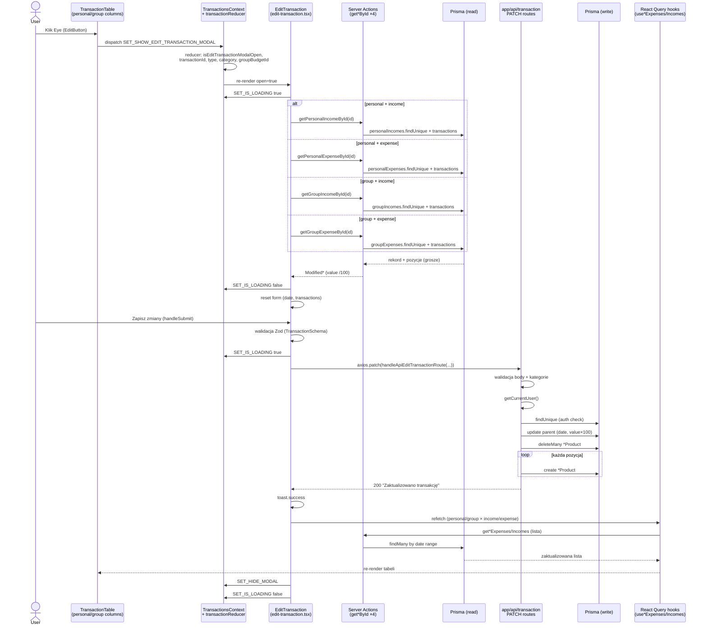
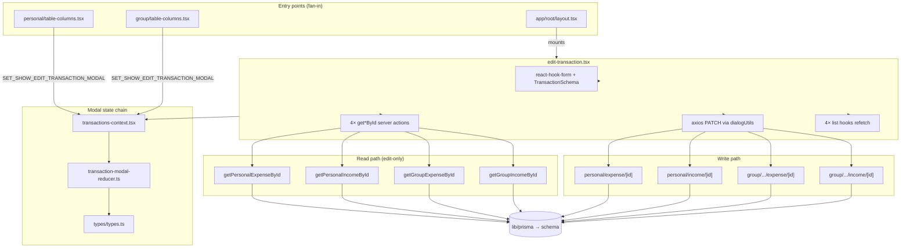

# Research: Analiza edycji transakcji

> **Change:** `edit-transaction-analysis`  
> **Data:** 2026-06-27 (weryfikacja ast-grep: 2026-06-27)  
> **Zakres:** stan obecny repozytorium (maj–wrzesień 2024, ostatni aktywny okres rozwoju)  
> **Źródła:** kod źródłowy, `context/map/repo-map.md`, artifact-1/2/3, dependency-cruiser, git log, **ast-grep 0.44.0**

---

## Weryfikacja ast-grep — twierdzenia strukturalne

Poniżej twierdzenia **strukturalne** z raportu (liczności, „tylko tutaj", powtarzalne kształty), wzorzec ast-grep użyty do weryfikacji, wynik i korekta.

| # | Twierdzenie | Wzorzec ast-grep | Wynik |
|---|-------------|------------------|-------|
| S1 | `<EditTransaction />` montowany w **1 miejscu** (layout) | `-p '<EditTransaction $$$/>' -l tsx` | **Potwierdzone** — `app/(root)/layout.tsx:24` |
| S2 | Import `EditTransaction` — **1 plik** | `-p "import { EditTransaction } from '@/components/transaction-modal/edit-transaction'" -l tsx` | **Potwierdzone** — `app/(root)/layout.tsx:11` |
| S3 | Dispatch `SET_SHOW_EDIT_TRANSACTION_MODAL` — **2 call-site'y UI** (personal + group) | `-p "'SET_SHOW_EDIT_TRANSACTION_MODAL'" -l tsx` | **Potwierdzone** — `personal/.../table-columns.tsx:33`, `group/.../table-columns.tsx:40`. Dodatkowo definicja typu/reducer: `transaction-modal-reducer.ts:20,58` (poza UI) |
| S4 | Import 4× `get*ById` — **tylko** `edit-transaction.tsx` | `-p "import getPersonalExpenseById from '@/actions/getPersonalExpenseById'" -l tsx` (+ analogicznie ×4) | **Potwierdzone** — wyłącznie `edit-transaction.tsx:17-20`. Żaden inny plik w `components/transaction-modal/` nie importuje `@/actions/` |
| S5 | Wywołania `get*ById` — **4 call-site'y, 1 plik** | `-p 'getPersonalExpenseById' -l tsx .` (+ ×4) | **Potwierdzone** — każda akcja: import + 1× await w `edit-transaction.tsx:88-98` |
| S6 | `handleApiEditTransactionRoute` — **1 konsument** (edit save) | `-p 'handleApiEditTransactionRoute' -l tsx .` | **Potwierdzone** — definicja `utils/dialogUtils.ts:54`; import + wywołanie `edit-transaction.tsx:25,186-191` |
| S7 | `axios.patch` w modałach — **tylko edit** (zapis transakcji) | `-p 'axios.patch' -l tsx components/transaction-modal` | **Doprecyzowane** — w modałach: tylko `edit-transaction.tsx:185`. W całym repo dodatkowo `app/(auth)/(routes)/activate/[id]/page.tsx:20` (poza flow edit) |
| S8 | `axios.post` w modałach add — **0 server actions, POST do API** | `-p 'axios.post' -l tsx components/transaction-modal` | **Doprecyzowane** — `add-expense.tsx:128` (`/api/ai`), `add-expense.tsx:162` (save), `add-income.tsx:106` (save). Add modals **nie** importują server actions; save idzie POST-em, ale add-expense ma też krok AI |
| S9 | `{ signal }` w axios — add **tak**, edit **nie** | `-p 'signal: newController.signal' -l tsx components/transaction-modal` | **Potwierdzone** — `add-expense.tsx:131,165`, `add-income.tsx:109`; **brak** w `edit-transaction.tsx` (patch bez 3. argumentu, `edit-transaction.tsx:185-193`) |
| S10 | `zodResolver(TransactionSchema)` — **3 modale** | `-p 'zodResolver(TransactionSchema)' -l tsx` | **Potwierdzone** — `add-expense.tsx:74`, `add-income.tsx:67`, `edit-transaction.tsx:141` |
| S11 | `TransactionSchema` w API transaction — **brak** | `-p 'TransactionSchema' -l ts app/api` | **Potwierdzone** — brak dopasowań. `formValidations` w API: tylko `CreateBudgetFormSchema` w `app/api/transaction/group/route.ts:8` |
| S12 | PATCH handlers — **4 route'y** | `-p 'async function PATCH' -l ts app/api/transaction` | **Potwierdzone** — 4 pliki `[transactionId]/route.ts` (personal expense/income, group expense/income), każdy `:16` |
| S13 | POST handlers w `app/api/transaction` — **4 CRUD + 3 inne** | `-p 'async function POST' -l ts app/api/transaction` | **Doprecyzowane** — **7 POST** łącznie: 4 create transakcji (`personal/expense`, `personal/income`, `group/.../expense`, `group/.../income`) + `group/route.ts` (budget), `member/route.ts`, `invitation/route.ts`. Raport „4 PATCH + 4 POST" dotyczy CRUD transakcji — poprawne |
| S14 | `deleteMany` + replace line items — **4 PATCH routes** | `-p 'deleteMany' -l ts app/api/transaction` (grep uzupełniający) | **Potwierdzone** — `personalExpenseProduct.deleteMany` `:89`, `personalIncomeProduct` `:89`, `groupExpenseProduct` `:85`, `groupIncomeProduct` `:85` |
| S15 | Brak `prisma.$transaction` w API transaction | `-p '\$transaction($$$)' -l ts app/api/transaction` | **Potwierdzone** — brak dopasowań |
| S16 | `include: { transactions: true }` — **4 get*ById** | `-p 'transactions: true' -l ts actions/get*ById.ts` | **Potwierdzone** — wszystkie 4 pliki `:20-21` |
| S17 | Konwersja `/100` — **4 get*ById** (parent + line items) | `-p '/ 100' -l ts actions/get*ById.ts` | **Potwierdzone** — po 3 wystąpienia na plik (linie ~30-36) |
| S18 | Personal read auth — `userId: currentUser.id` w `findUnique` | `-p 'userId: currentUser.id' -l ts actions/getPersonal*ById.ts` | **Potwierdzone** — `getPersonalExpenseById.ts:18`, `getPersonalIncomeById.ts:18` |
| S19 | Group read — `findUnique` **bez** `userId` | inspekcja `where: { id: … }` w group get*ById | **Potwierdzone** — `getGroupExpenseById.ts:16-17`, `getGroupIncomeById.ts:16-17` |
| S20 | Group PATCH owner check → 403 | `-p 'currentExpense.userId !== currentUser.id' -l ts app/api/transaction/group` | **Potwierdzone** — expense route `:68,118`; income: `currentIncome.userId` `:68,118` |
| S21 | Refetch hooks — edit **4**, add-expense **2**, add-income **2** | `-p 'usePersonalExpenses' -l tsx components/transaction-modal` (+ analogicznie) | **Potwierdzone** — edit: 4 hooki (`edit-transaction.tsx:64-77`); add-expense: `usePersonalExpenses` + `useGroupExpenses`; add-income: `usePersonalIncomes` + `useGroupIncomes` |
| S22 | Fan-out Ce — edit **26**, add-expense **20** | `dependency-cruiser -m -T json` | **Potwierdzone** — bezpośrednie zależności modułu |
| S23 | Pliki testowe — **14** (10 unit + 4 E2E) | `find tests e2e -name '*.test.*' -o -name '*.spec.ts'` | **Potwierdzone** |
| S24 | Brak referencji edit w testach | grep `edit-transaction\|SET_SHOW_EDIT\|formValidations` w `tests/` `e2e/` | **Potwierdzone** — brak dopasowań (E2E exercise edit przez UI, bez importu nazw) |
| S25 | E2E „Zapisz zmiany" — **2 specy** | grep w `e2e/` | **Potwierdzone** — `personal-budget.spec.ts:30`, `group-budget.spec.ts:30` |
| S26 | Wniosek typu z kwoty — **4 miejsca** (edit + delete) | `-p "value > 0 ? 'income' : 'expense'" -l tsx` | **Doprecyzowane** — `personal/table-columns.tsx:154-155`, `group/table-columns.tsx:183,189` (ten sam wzorzec na EditButton **i** DeleteButton) |
| S27 | Commity `edit-transaction.tsx` — **10** | `git log --oneline -- edit-transaction.tsx \| wc -l` | **Potwierdzone** |

**Metryki z dependency-cruiser (fan-in 27 / 37)** — pochodzą z artifact-2, nie re-liczone ast-grep w tej iteracji.

---

## Feature overview

Edycja transakcji to **globalny modal CRUD** montowany w shellu aplikacji, otwierany z tabel transakcji budżetu personalnego i grupowego. Użytkownik klika ikonę oka (Eye) w kolumnie „Szczegóły", modal ładuje istniejącą transakcję, pozwala zmienić datę i pozycje (tytuł, kategoria, kwota), a po zapisie odświeża tabelę.

### Co robi feature

| Aspekt | Opis |
|--------|------|
| **Wejście UI** | Przycisk Eye w `table-columns.tsx` (personal + group) → dispatch `SET_SHOW_EDIT_TRANSACTION_MODAL` |
| **Stan modala** | `TransactionsContext` + `transaction-modal-reducer` — `transactionId`, `transactionType` (income/expense), `transactionCategory` (personal/group), `groupBudgetId` |
| **Odczyt danych** | 4 server actions `get*ById` → Prisma `findUnique` + `include: { transactions: true }` → konwersja grosze→PLN (`/100`) |
| **Formularz** | `react-hook-form` + Zod `TransactionSchema` — data + tablica pozycji |
| **Zapis** | `axios.patch` → 4 warianty route PATCH w `app/api/transaction/` (jedyny patch w modałach; ast-grep S7) |
| **Zapis w DB** | Update rekordu nadrzędnego (data, suma ×100) → `deleteMany` pozycji → `create` nowych pozycji |
| **Odświeżenie UI** | React Query refetch (`usePersonalExpenses/Incomes`, `useGroupExpenses/Incomes`) — **nie** przez reducer |
| **Zamknięcie** | `SET_HIDE_MODAL` czyści flagi modala i identyfikatory |

### Macierz wariantów (4 kwadranty)

| Kategoria | Typ | Odczyt (server action) | Zapis (PATCH route) |
|-----------|-----|------------------------|---------------------|
| personal | expense | `getPersonalExpenseById` | `/api/transaction/personal/expense/{id}` |
| personal | income | `getPersonalIncomeById` | `/api/transaction/personal/income/{id}` |
| group | expense | `getGroupExpenseById` | `/api/transaction/group/{groupBudgetId}/expense/{id}` |
| group | income | `getGroupIncomeById` | `/api/transaction/group/{groupBudgetId}/income/{id}` |

Typ transakcji (income/expense) jest **wnioskowany z znaku kwoty** w wierszu tabeli: `value > 0 ? 'income' : 'expense'` — w **4 miejscach** (EditButton + DeleteButton, personal + group; ast-grep S26).

### Powiązania z repo-map (strefy ryzyka dotykające edit)

| Strefa z repo-map | Rola w edycji |
|-------------------|---------------|
| **`edit-transaction.tsx`** (#2 ryzyko) | Jedyny modal importujący 4 server actions bezpośrednio; Ce=26 zależności |
| **`types/types.ts`** (#1 ryzyko) | `TransactionState`, `TransactionValues`, `Modified*` — fan-in 27 |
| **`contexts/transactions-context` + reducer** | Otwarcie/zamknięcie modala, loading flag |
| **`actions/` + `app/api/transaction/`** | Dual path: READ przez actions, WRITE przez REST |
| **`utils/formValidations.ts`** (#5 ryzyko) | `TransactionSchema` — współdzielony z add-expense/add-income (UI); API transaction importuje tylko `CreateBudgetFormSchema` (group budget), nie `TransactionSchema` (ast-grep S11) |
| **`app/(root)/layout.tsx`** | Montuje `<EditTransaction />` globalnie |
| **`getCurrentUser.ts`** (#3 ryzyko) | Auth gate dla actions i PATCH routes (fan-in 37) |

### Różnice personal vs group

| Concern | Personal | Group |
|---------|----------|-------|
| **Otwarcie modala** | `groupBudgetId: ''` | `groupBudgetId` z wiersza tabeli |
| **Odczyt — auth** | `findUnique` z `userId: currentUser.id` | `findUnique` **bez** filtra właściciela |
| **Zapis — auth** | `where: { id, userId }` | Sprawdzenie `record.userId === currentUser.id` → 403 |
| **Przycisk edit w UI** | Brak bramki właściciela | Brak bramki właściciela (delete ma bramkę) |
| **Refetch** | Zakres dat | Zakres dat + `groupBudgetId` |

### Odstępstwo od wzorca add-expense/add-income

Modale dodawania używają **hooks + axios POST** (bez importów server actions). `add-expense` ma dodatkowo `axios.post` do `/api/ai` w kroku FILE (`add-expense.tsx:128`). `edit-transaction.tsx` jest **jedynym modalem** z bezpośrednimi importami 4 server actions do odczytu (ast-grep S4–S5). To potwierdza anomalię opisaną w repo-map i [`edit-transaction-testability.svg`](../../map/edit-transaction-testability.svg).

---

## Trace e2e — ścieżka od UI do DB i z powrotem

### Sekwencja kroków (file:line)

| # | Warstwa | Akcja | Plik:linia |
|---|---------|-------|------------|
| 1 | **Entry — personal** | Klik Eye → dispatch `SET_SHOW_EDIT_TRANSACTION_MODAL` | `app/(root)/(routes)/personal/components/table-columns.tsx:31-40` |
| 1b | **Entry — group** | Klik Eye → dispatch z `groupBudgetId` | `app/(root)/(routes)/group/[id]/components/table-columns.tsx:39-46` |
| 2 | **Reducer** | Ustawia `isEditTransactionModalOpen`, `transactionId`, typ, kategorię | `reducers/transaction-modal-reducer.ts:58-66` |
| 3 | **Context** | Provider udostępnia stan | `contexts/transactions-context.tsx:42-48` |
| 4 | **Layout** | Modal zawsze zamontowany | `app/(root)/layout.tsx:24` |
| 5 | **Modal open** | `open={isEditTransactionModalOpen}` | `components/transaction-modal/edit-transaction.tsx:264-265` |
| 6 | **Load trigger** | `useEffect` na zmianę `transactionId/type/category` | `edit-transaction.tsx:105-123` |
| 7 | **Loading on** | `SET_IS_LOADING true` | `edit-transaction.tsx:109` → `transaction-modal-reducer.ts:83-87` |
| 8 | **Fetch branch** | `getSpecificTransaction()` — 4 gałęzie | `edit-transaction.tsx:83-103` |
| 9 | **Server action read** | `getPersonalExpenseById` (przykład) | `actions/getPersonalExpenseById.ts:7-42` |
| 10 | **Auth gate** | `getCurrentUser()` | `actions/getPersonalExpenseById.ts:9-13` |
| 11 | **Prisma read** | `findUnique` + `include: { transactions: true }` | `actions/getPersonalExpenseById.ts:15-22` |
| 12 | **Konwersja** | `value / 100` na rekordzie i pozycjach | `actions/getPersonalExpenseById.ts:29-37` |
| 13 | **Loading off** | `SET_IS_LOADING false` | `edit-transaction.tsx:113` |
| 14 | **Hydrate form** | `setTransaction` + `reset({ date, transactions })` | `edit-transaction.tsx:115-120` |
| 15 | **Render UI** | `TransactionDatePicker` + `TransactionTableModal` | `edit-transaction.tsx:231-241` |
| 16 | **Submit** | `handleSubmit(saveData)` — „Zapisz zmiany" | `edit-transaction.tsx:254-257` |
| 17 | **Client validation** | Zod `TransactionSchema` | `utils/formValidations.ts:44-54` |
| 18 | **saveData guard** | `if (isLoading \|\| !transaction) return` | `edit-transaction.tsx:178` |
| 19 | **Build URL** | `handleApiEditTransactionRoute(...)` | `utils/dialogUtils.ts:54-68` |
| 20 | **HTTP PATCH** | `axios.patch(url, { date, transactions })` | `edit-transaction.tsx:185-193` |
| 21 | **API validation** | Ręczne sprawdzenia date, transactions, title, value, categoryId | `app/api/transaction/personal/expense/[transactionId]/route.ts:16-56` |
| 22 | **API auth** | `getCurrentUser()` → 401 | route ~L58-62 |
| 23 | **Record auth** | personal: `where: { id, userId }`; group: owner check → 403 | route ~L64-73 |
| 24 | **Prisma write** | `update` parent (date, value×100, expense negated) | route ~L75-88 |
| 25 | **Replace line items** | `deleteMany` + pętla `create` | route ~L89-104 |
| 26 | **Success toast** | `toast.success(response.data)` | `edit-transaction.tsx:195` |
| 27 | **Refetch** | `handleRefetch()` — odpowiedni hook React Query | `edit-transaction.tsx:159-175` |
| 28 | **Table refresh** | Hook → server action list → Prisma `findMany` | np. `hooks/usePersonalExpenses.ts:10-14` |
| 29 | **Hide modal** | `SET_HIDE_MODAL` | `edit-transaction.tsx:151-156` → `transaction-modal-reducer.ts:67-77` |
| 30 | **Loading off** | `finally` block | `edit-transaction.tsx:214-216` |

### Diagram sekwencji (Mermaid)



---

## Luki w testach

### Podsumowanie pokrycia

| Warstwa | Status | Szczegóły |
|---------|--------|-----------|
| **E2E** | Częściowe | 2 testy happy-path: personal expense + group expense, tylko zmiana kwoty |
| **Unit** | ~0% | Brak testów `edit-transaction`, reducera, `formValidations`, `dialogUtils` |
| **Integration / API** | Brak | Zero testów 4 route PATCH (ast-grep S12: 4 handlery `async function PATCH`) |

**Inwentarz testów w repo:** 14 plików (10 Vitest unit, 4 Playwright E2E). Żaden nie referencjonuje `edit-transaction`, `SET_SHOW_EDIT`, `transaction-modal-reducer`, `formValidations`, `handleApiEditTransactionRoute`.

### E2E — co jest pokryte

| Spec | Zakres edit | Luki |
|------|-------------|------|
| `e2e/personal-budget.spec.ts:11-38` | Create expense → open edit (pierwszy button w wierszu) → zmiana spinbutton 100→200 → „Zapisz zmiany" | Income, data, tytuł, kategoria, dodawanie/usuwanie wierszy, błędy walidacji, cancel, błędy API |
| `e2e/group-budget.spec.ts:10-38` | Analogicznie dla group expense | Jak wyżej |
| `e2e/personal-budget.spec.ts:40-66` (AI mock) | Create via AI → **delete only** | Brak edit |

### Tabela pokrycia ścieżki (priorytetyzacja)

#### Krytyczne — integralność danych / auth / pieniądze

| Element | Lokalizacja | Status | Ryzyko |
|---------|-------------|--------|--------|
| PATCH personal expense | `app/api/transaction/personal/expense/[transactionId]/route.ts:16-107` | Nie pokryte | **Krytyczne** — update DB, value×100, deleteMany + recreate |
| PATCH personal income | `.../personal/income/[transactionId]/route.ts` | Nie pokryte | **Krytyczne** |
| PATCH group expense | `.../group/.../expense/[transactionId]/route.ts` | Częściowo (E2E happy path) | **Krytyczne** — gałąź 403 untested |
| PATCH group income | `.../group/.../income/[transactionId]/route.ts` | Nie pokryte | **Krytyczne** |
| Auth 401/403 na PATCH | Wszystkie 4 routes ~L58-73 | Nie pokryte | **Krytyczne** |
| Walidacja API (date, empty transactions, value≤0, categoryId) | Wszystkie 4 routes ~L21-56 | Nie pokryte | **Wysokie** |
| `getGroupExpenseById` — brak owner check | `actions/getGroupExpenseById.ts:15-22` | Nie pokryte | **Krytyczne** — każdy zalogowany może odczytać dowolny ID |
| `getGroupIncomeById` — brak owner check | `actions/getGroupIncomeById.ts:15-22` | Nie pokryte | **Krytyczne** |
| Drift walidacji UI vs API | `TransactionSchema` vs ręczne checks w PATCH | Nie pokryte | **Krytyczne** |

#### Wysokie — logika klienta edit

| Element | Lokalizacja | Status | Ryzyko |
|---------|-------------|--------|--------|
| `EditTransaction` (komponent) | `edit-transaction.tsx:45-273` | Częściowo (E2E expense) | **Wysokie** — Ce=26 deps (ast-grep S22), brak unit isolation |
| `saveData` — gałęzie błędów (Axios, cancel, unknown) | `edit-transaction.tsx:198-213` | Nie pokryte | **Wysokie** |
| Load failure — `get*ById` zwraca null | `edit-transaction.tsx:115-121` | Nie pokryte | **Wysokie** — cichy pusty modal |
| `getSpecificTransaction` — income paths | `edit-transaction.tsx:87-88, 95-96` | Nie pokryte | **Wysokie** |
| `TransactionSchema` (Zod) | `utils/formValidations.ts:44-54` | Nie pokryte | **Wysokie** |
| `handleApiEditTransactionRoute` fallback `''` | `utils/dialogUtils.ts:68` | Nie pokryte | **Średnie** |

#### Średnie — stan, UI, refetch

| Element | Lokalizacja | Status | Ryzyko |
|---------|-------------|--------|--------|
| `SET_SHOW_EDIT_TRANSACTION_MODAL` | `transaction-modal-reducer.ts:58-66` | Implikowane E2E | **Średnie** |
| `handleRefetch` — 4 gałęzie | `edit-transaction.tsx:159-175` | 2/4 (E2E expense) | **Średnie** |
| `AbortController` — cleanup bez signal w patch | `edit-transaction.tsx:181-182 vs 185-193` | Nie pokryte | **Średnie** |
| `TransactionTableModal` — add/delete/edit rows w kontekście edit | `ui/transaction-table-modal.tsx:45-93` | Częściowo | **Średnie** |
| `TransactionDatePicker` | `ui/transaction-date-picker.tsx:19-24` | Nie pokryte | **Średnie** |

#### Niskie / poza ścieżką edit

| Element | Status | Uwaga |
|---------|--------|-------|
| Dashboard / statistics | Nie pokryte | **Poza ścieżką edit** — refetch nie dotyka dashboardu |
| `tests/pages/personal/transactions.test.tsx` | Render only | Brak interakcji z Edit |
| `tests/components/shared/actions-panel.test.tsx` | Add/date only | Brak `SET_SHOW_EDIT` |

### Kolejność domknięcia luk (rekomendacja)

1. **4 route PATCH** — unit/integration z mock Prisma + auth
2. **Wspólny kontrakt walidacji** — deduplikacja `TransactionSchema` vs inline API checks
3. **`getGroup*ById` owner check** — fix + test
4. **Unit: reducer + formValidations + dialogUtils** — szybkie pure-function testy
5. **E2E rozszerzone** — income, data, tytuł, kategoria, multi-row, błędy walidacji

---

## Blast radius — co musi zmienić się razem

### Graf statyczny (dependency-cruiser)

```
Fan-in edit-transaction.tsx:  1 bezpośredni importer (layout.tsx)
Fan-out edit-transaction.tsx: Ce = 26 (vs add-expense Ce = 20)
Hub types/types.ts:           fan-in 27
Hub getCurrentUser.ts:        fan-in 37
```

#### Architektura dual-path (unikalna dla edit)

| Operacja | Mechanizm | Pliki |
|----------|-----------|-------|
| **Load for edit** | Server actions | `actions/getPersonalExpenseById.ts`, `getPersonalIncomeById.ts`, `getGroupExpenseById.ts`, `getGroupIncomeById.ts` |
| **Save edit** | axios PATCH | `utils/dialogUtils.ts` → 4× `app/api/transaction/**/[transactionId]/route.ts` |

`get*ById` actions mają **jedynego konsumenta w repo**: `edit-transaction.tsx`.

### Szwy interfejsu — checklista współzmian

| Jeśli zmieniasz… | Musisz zaktualizować… |
|------------------|----------------------|
| **Pola formularza** (`TransactionSchema`) | 3 modale UI (ast-grep S10) + **ręczną walidację** w 4 PATCH + 4 POST routes CRUD (API **nie** importuje `TransactionSchema`; ast-grep S11, S13) |
| **Kształt pozycji** (`Transaction`) | `types.ts`, `get*ById` mapping, PATCH delete/create loops, `TransactionTableModal`, E2E |
| **`TransactionState` / reducer actions** | Oba `table-columns.tsx`, `edit-transaction`, testy actions-panel |
| **`handleApiEditTransactionRoute`** | `edit-transaction` save; mirror w `handleApiDeleteRoute` |
| **`get*ById` actions** | Tylko `edit-transaction` — bezpieczne do refaktoru na hook |
| **PATCH API routes** | Edit save + DELETE na tych samych plikach; auth via `getCurrentUser` |
| **`prisma/schema.prisma`** | Migracja → `prisma generate` → `Modified*` types → 4 actions → 4 PATCH → hooks → E2E |
| **Konwersja grosze/PLN** | Duplikacja: actions (`÷100`) i API (`×100`) — ryzyko driftu |
| **Global modal mount** | `layout.tsx` tylko przy dodawaniu/usuwaniu komponentu modala |

### Git co-change — klastry historyczne

**10 commitów** dotykających `edit-transaction.tsx` (maj–wrzesień 2024). Kluczowe współzmiany:

| Commit (theme) | Współzmieniane pliki |
|----------------|---------------------|
| Modal refactor | API routes, modal shell, UI subcomponents, utils |
| Validations | `formValidations.ts`, add modals, API routes |
| Context/reducer | `transactions-context`, `types/types.ts`, `layout.tsx`, `table-columns`, add modals |
| Group budget | **`prisma/schema.prisma`**, `formValidations`, types, group API, layout |
| Group edit prep | **`getGroup*ById`**, group/personal `table-columns`, context, reducer, types |
| Group edit API | group PATCH routes, **`dialogUtils.ts`** |

**Ranking współwystępowania w folderze `transaction-modal/`:**

```
11  add-income.tsx
10  edit-transaction.tsx
 9  transaction-modal.tsx
 8  add-expense.tsx
 7  ui/transaction-table-modal.tsx
```

**Stack-wide (edit-related paths):**

```
10  edit-transaction.tsx
 7  dialogUtils.ts
 5  transactions-context.tsx
 4  transaction-modal-reducer.ts
 3  getPersonalExpenseById.ts
 1  getGroupExpenseById.ts
```

**Artifact-1 hub co-changes:** `types/types.ts` współzmienia się ze średnio **7.2 innymi obszarami** na commit; **4×** z `transactions-context` + `transaction-modal-reducer`.

### EDIT vs add-expense — porównanie blast radius

| Wymiar | edit-transaction | add-expense |
|--------|------------------|-------------|
| Direct importers | 1 (`layout.tsx`) | 1 (`layout.tsx`) |
| Ce (dependencies) | **26** | **20** |
| Server actions | **4** (fetch by ID) | **0** |
| Data hooks | **4** (personal+group × income+expense; ast-grep S21) | **2** (expenses; add-income analogicznie **2** incomes) |
| HTTP | PATCH × **4** wariantów (S12) | POST × 2 expense routes + opcjonalnie `/api/ai` w add-expense |
| Testability | Najgorsza w repo | Średnia — hooks only |
| Git churn (folder rank) | 10 | 8 |

**Wniosek:** add-expense ma niższy blast radius — pomija warstwę read (`get*ById`). Edit dodaje macierz 4×4 (personal/group × income/expense) po obu stronach read i write.

### Diagram blast radius



---

## Technical debt

Poniższe punkty opisują **zidentyfikowany dług techniczny** w przepływie edycji transakcji — uporządkowany według wpływu na bezpieczeństwo, utrzymanie i testowalność.

### 1. Anomalia architektoniczna — dual data path (KRYTYCZNY)

`edit-transaction.tsx` jest **jedynym modalem** importującym 4 server actions bezpośrednio do odczytu (ast-grep S4–S5), podczas gdy zapis idzie przez axios PATCH do REST API. Modale add-expense/add-income używają hooks + axios POST; add-expense dodatkowo POST do `/api/ai` (`add-expense.tsx:128`, ast-grep S8).

**Skutki:**
- Niemożność sensownego unit testu komponentu (26 zależności, mieszanie server actions + HTTP client)
- Brak spójnego wzorca data-fetching w warstwie UI
- Trudniejszy refactor — dwa niezależne kontrakty (actions vs API routes)

**Rekomendacja:** Wydzielić `useTransactionById(category, type, id)` hook zastępujący 4 bezpośrednie importy — wzorzec jak w add modals.

### 2. Duplikacja walidacji UI vs API (KRYTYCZNY)

- **Klient:** Zod `TransactionSchema` w `utils/formValidations.ts:44-54`
- **Serwer:** Ręczne sprawdzenia inline w każdym z 4 PATCH routes (~L21-56); API **nie importuje** `TransactionSchema` (ast-grep S11 — jedyny import z `formValidations` w transaction API to `CreateBudgetFormSchema`)

Zmiana reguł walidacji w `TransactionSchema` **nie propaguje się** automatycznie do API. Brak wspólnego kontraktu testowego.

**Rekomendacja:** Wydzielić wspólny schema (np. shared Zod) importowany przez UI i API routes, lub centralny validator.

### 3. Asymetria auth read vs write — group (KRYTYCZNY)

| Operacja | Personal | Group |
|----------|----------|-------|
| **Read (`get*ById`)** | `where: { id, userId }` | `where: { id }` — **brak filtra właściciela** |
| **Write (PATCH)** | `where: { id, userId }` | Owner check → 403 |

Każdy zalogowany użytkownik może **odczytać dane** dowolnej transakcji grupowej znając ID (`getGroupExpenseById.ts:15-22`). PATCH blokuje zapis, ale dane są widoczne w modalu.

**Rekomendacja:** Dodać sprawdzenie członkostwa/właściciela w `getGroup*ById` — spójne z PATCH.

### 4. Brak testów na krytycznej ścieżce (WYSOKI)

- **0 unit testów** na `edit-transaction`, reducer, `formValidations`, `dialogUtils`
- **0 integration testów** na 4 PATCH routes (pieniądze, auth, replace line items)
- **2 cienkie E2E** — tylko happy path expense, tylko zmiana kwoty
- **0 E2E** dla income edit (personal i group)

Feature chroniony praktycznie wyłącznie przez 2 testy Playwright zmieniające spinbutton.

### 5. AbortController niewykorzystany (ŚREDNI)

`edit-transaction.tsx:181-182` tworzy `AbortController`, ale **nie przekazuje `{ signal }`** do `axios.patch` (ast-grep S9: signal w `add-expense.tsx:131,165`, `add-income.tsx:109`; brak w edit). Cleanup na unmount (`:125-131`) i cancel w `hideModal` (`:151-154`) nie anulują in-flight PATCH.

### 6. Cichy failure przy load (ŚREDNI)

Gdy `get*ById` zwraca `null` (brak rekordu, brak auth, catch), modal otwiera się bez danych — brak toastu/błędu dla użytkownika (`edit-transaction.tsx:115-121`). Guard w `saveData` (`:178`) blokuje zapis, ale UX jest mylący.

### 7. Replace-all line items zamiast diff (ŚREDNI)

PATCH routes implementują update jako: update parent → `deleteMany` wszystkich pozycji → `create` od nowa (4 route'y; ast-grep S14). Brak transakcji Prisma `$transaction` (ast-grep S15) — ryzyko częściowego stanu przy błędzie w pętli create.

### 8. Konwersja grosze/PLN rozproszona (ŚREDNI)

Logika `/100` w server actions i `×100` (z negacją dla expense) w PATCH routes — duplikacja bez wspólnej utility, ryzyko driftu przy zmianach.

### 9. Montowanie wszystkich 4 hooków refetch (NISKI)

`edit-transaction.tsx:64-81` montuje **4 hooki React Query** niezależnie od aktywnego wariantu (personal/group × income/expense). Add modals montują tylko potrzebne hooki.

### 10. Brak resetu formularza przy zamknięciu (NISKI)

Add modals resetują form z timeoutem przy hide. Edit trzyma `transaction` state — potencjalny flash starych danych przy szybkim ponownym otwarciu innej transakcji (choć `useEffect` na `transactionId` powinien nadpisać).

### 11. Współdzielony `TransactionSchema` z add modals (INFORMACYJNY)

Zmiana schematu formularza dotyka **3 modali UI** (ast-grep S10) + **8 route'ów CRUD** (4 PATCH + 4 POST transakcji; ast-grep S12–S13). W `app/api/transaction` jest łącznie **7 POST** (3 dodatkowe: budget, member, invitation). To nie jest bug, ale permanentny koszt utrzymania wynikający z decyzji z fazy Q2 2024 (commit `ea1a9ee`).

---

## Wnioski

1. **Edycja transakcji to cross-layer feature** — table → global context → form → 4 server actions (read) → 4 PATCH routes (write) → 4 refetch hooks, spięte przez `types/types.ts` i zduplikowaną walidację API.

2. **Największe ryzyko brownfield:** brak testów API (pieniądze + auth), drift walidacji, asymetria auth read group.

3. **Najniższy koszt poprawy testowalności:** unit testy na `transaction-modal-reducer` + `formValidations` + `dialogUtils`, potem wydzielenie `useTransactionById` hook — bez zmiany zachowania użytkownika.

4. **Przed refaktorem:** uruchomić istniejące E2E (`personal-budget.spec.ts`, `group-budget.spec.ts`) jako baseline.

---

## Źródła

| Źródło | Ścieżka |
|--------|---------|
| Weryfikacja strukturalna | ast-grep 0.44.0 (sekcja powyżej) |
| Mapa repo | `context/map/repo-map.md` |
| Graf testability | `context/map/edit-transaction-testability.svg` |
| Terytorium git | `context/map/artifact-1-territory.md` |
| Struktura (dependency-cruiser) | `context/map/artifact-2-structure.md` |
| Autorzy | `context/map/artifact-3-contributors.md` |
| Główny plik feature | `components/transaction-modal/edit-transaction.tsx` |
