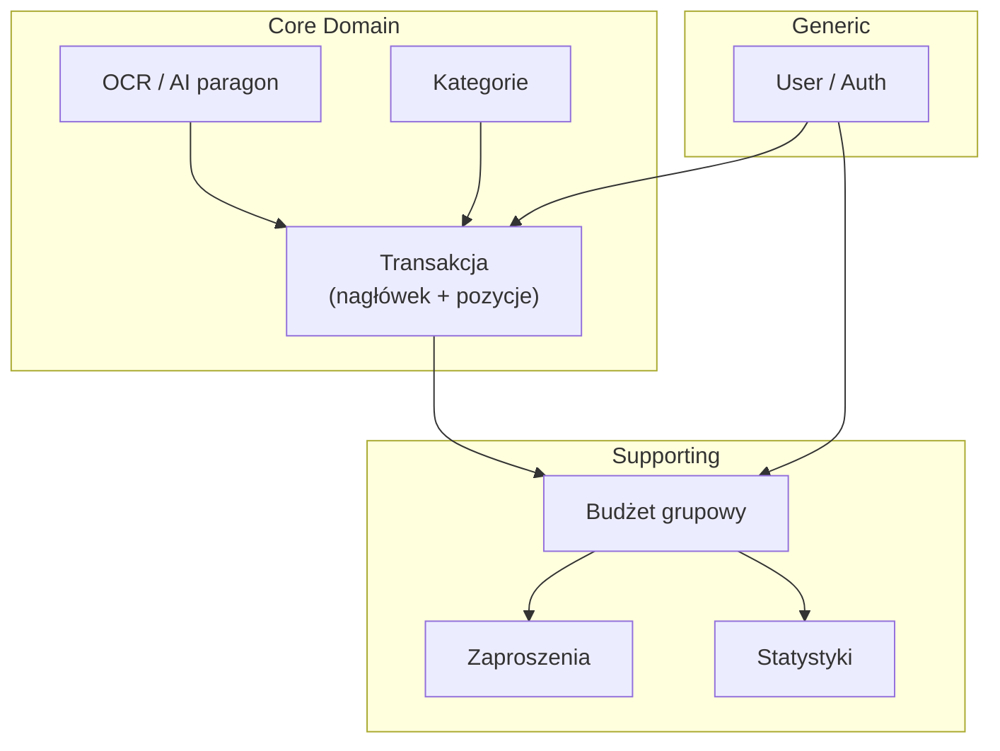

# Destylacja domeny — iSave

> Metoda: odkrycie → analiza → klasyfikacja. Produkt: **mapa domeny**, nie kod.

---

## KROK 0 — Kontekst projektu

### Źródła wymagań

| Dokument | Status |
|----------|--------|
| `context/foundation/prd.md` | **BRAK** |
| `context/foundation/tech-stack.md` | **BRAK** |
| `README.md` | **TAK** — wizja produktu, feature list, stack |
| `context/map/repo-map.md` | **TAK** — narracja brownfield, warstwy, ryzyka |
| `context/changes/edit-transaction-analysis/research.md` | **TAK** — głęboka analiza flow transakcji |
| `context/changes/refactor-opportunities/research.md` | **TAK** — dług domenowy vs kod |

**Ograniczenie:** Brak formalnego PRD i tech-stack. Ubiquitous Language i klasyfikacja opierają się na README, mapie repo, research change'ów oraz weryfikacji kodu (`prisma/schema.prisma`, `actions/`, `app/api/`).

### Wizja produktu (z README)

> „a simplified expense report app based on your receipts (OCR and AI related)" — `README.md:2`

Kluczowe deklarowane możliwości: budżety osobiste i grupowe, kontrola dostępu oparta na rolach, statystyki w zakresie dat, OCR/AI z limitem 10 zapytań/dzień, CRUD transakcji, aktywacja konta e-mailem — `README.md:19-27`.

### Stack i struktura repo

| Warstwa | Lokalizacja | Rola domenowa |
|---------|-------------|---------------|
| Persystencja / model danych | `prisma/schema.prisma` | Encje MongoDB (transakcje, budżety, użytkownicy, kategorie) |
| Kontrakt TS | `types/types.ts` | Typy transakcji + stan UI modali (mieszane) |
| Odczyt (server actions) | `actions/` | Listy, pojedyncze rekordy, statystyki, kategorie |
| Zapis (REST) | `app/api/transaction/`, `app/api/ai/`, `app/api/register/` | Mutacje transakcji, AI, rejestracja |
| UI / reguły prezentacji | `components/transaction-modal/`, `app/(root)/(routes)/` | Formularze, tabele, wykresy |
| Walidacja | `utils/formValidations.ts` | Zod (UI); API — częściowo inline |
| Auth | `actions/getCurrentUser.ts`, `pages/api/auth/[...nextauth].ts` | Bramka sesji |

Model warstwowy (dependency-cruiser): `types → contexts/reducers → hooks → components → app/(routes)`; zapis idzie `app/api → actions/utils/types` — `context/map/repo-map.md:101-107`.

---

## KROK 1 — Ubiquitous Language

Poniższe pojęcia **odkryto** w dokumentach i kodzie. Każde ma cytat źródłowy i lokalizację w kodzie (lub adnotację BRAK).

### Rdzeń — rejestracja wydatków i przychodów

| Pojęcie | Definicja | Cytat źródłowy | Kod |
|---------|-----------|----------------|-----|
| **Transakcja (nagłówek)** | Rekord z datą, sumą wartości i kolekcją pozycji (line items). Osobne tabele dla personal/group × expense/income. | `date`, `value`, `transactions` na modelach `PersonalExpenses`, `GroupExpenses` itd. — `prisma/schema.prisma:72-81`, `:115-127` | `prisma/schema.prisma:72-81` |
| **Pozycja transakcji (produkt)** | Pojedyncza linia: tytuł, kwota, identyfikator kategorii. | `title`, `value`, `categoryId` — `prisma/schema.prisma:87-89` | `types/types.ts:12-17` (`Transaction`) |
| **Wydatek (expense)** | Transakcja kosztowa; suma nagłówka przechowywana jako **ujemna** liczba całkowita (grosze). | `value: -transactions.reduce(...)` — `app/api/transaction/personal/expense/route.ts:63-66` | `app/api/transaction/personal/expense/[transactionId]/route.ts:82-85` |
| **Przychód (income)** | Transakcja dochodowa; suma nagłówka **dodatnia** (grosze). | Analogiczny wzorzec w `PersonalIncomes` / `GroupIncomes` — `prisma/schema.prisma:50-59`, `:140-152` | `app/api/transaction/personal/income/route.ts` (ten sam wzorzec co expense) |
| **Typ transakcji (income/expense)** | Rozróżnienie przychód vs wydatek **wnioskowane ze znaku kwoty** w UI, nie kolumną w DB. | `value > 0 ? 'income' : 'expense'` — `app/(root)/(routes)/personal/components/table-columns.tsx:154-155` | `types/types.ts:27` (`TransactionType`) |
| **Kategoria wydatku / przychodu** | Słownik referencyjny w DB; pozycja musi wskazywać istniejący `categoryId`. | „More than a dozen default expense and income categories" — `README.md:5` | `prisma/schema.prisma:165-179`; `actions/getExpenseCategories.ts:7-8` |
| **Grosze (jednostka przechowywania)** | Kwoty w bazie jako `Int` (grosze); UI/API operują na PLN z konwersją `/100` i `×100`. | `value Int` — `prisma/schema.prisma:56`, `:77`; konwersja — `actions/getPersonalExpenseById.ts:29-36` | 19+ plików z `/100` lub `*100` (research refactor-opportunities V19) |
| **Zakres dat** | Filtr list i statystyk — transakcje między `date.from` a `date.to`. | „Creation of transaction statistics based on a selected date range" — `README.md:22` | `actions/getPersonalExpenses.ts:17-23` |
| **Paragon / OCR** | Obraz paragonu konwertowany na tekst w aplikacji (Tesseract). | „Read receipt images and convert to text" — `README.md:7` | `components/transaction-modal/add-expense.tsx:32-35` (krok `STEPS.FILE`) |
| **Ekstrakcja AI** | Tekst OCR → JSON pozycji wydatków przez model językowy (ChatGPT). | „ChatGPT support for reading text for specific expenses" — `README.md:25` | `app/api/ai/route.ts:74-88`, `:92-98` |
| **Limit zapytań AI** | Użytkownik ma domyślnie 10 wywołań/dzień; reset przy nowym dniu kalendarzowym. | „limit of 10 queries per day" — `README.md:7` | `prisma/schema.prisma:38-39`; `app/api/ai/route.ts:46-58`, `:60-65` |

### Supporting — budżet grupowy i współpraca

| Pojęcie | Definicja | Cytat źródłowy | Kod |
|---------|-----------|----------------|-----|
| **Budżet grupowy (GroupBudget)** | Nazwany kontener współdzielonych transakcji grupowych z właścicielem. | „Ability to create multiple group budgets with other users" — `README.md:6` | `prisma/schema.prisma:94-105` |
| **Właściciel budżetu (owner)** | Użytkownik tworzący budżet; jedyny uprawniony do zaproszeń, usuwania budżetu i członków. | `ownerId: currentUser.id` przy tworzeniu — `app/api/transaction/group/route.ts:27-31` | `app/api/transaction/group/[groupBudgetId]/member/route.ts:29-30` |
| **Członek budżetu (member)** | Użytkownik zaakceptowany do budżetu; może dodawać transakcje grupowe. | Sprawdzenie `isOwner \|\| isMember` przy tworzeniu wydatku — `app/api/transaction/group/[groupBudgetId]/expense/route.ts:77-81` | `prisma/schema.prisma:107-113` |
| **Zaproszenie (InviteNotification)** | Powiadomienie wysłane przez właściciela do użytkownika identyfikowanego przez `inviteId`. | Flow zaproszenia opisany w research — `context/changes/edit-transaction-analysis/research.md:89-96` | `prisma/schema.prisma:181-189`; `app/api/transaction/group/[groupBudgetId]/member/route.ts:54-58` |
| **Numer ID (inviteId)** | Publiczny identyfikator użytkownika do zaproszeń (UUID). | `inviteId: crypto.randomUUID()` przy rejestracji — `app/api/register/route.ts:42` | `prisma/schema.prisma:31` |
| **Autor transakcji grupowej** | Transakcja grupowa zapisuje `userId` i `userName` twórcy; przy usunięciu członka — anonimizacja. | `userId`, `userName` — `prisma/schema.prisma:124-126`; `userName: 'Nieokreślony'` — `app/api/transaction/group/[groupBudgetId]/member/[inviteId]/route.ts:69-72` | j.w. |
| **Statystyki budżetu grupowego** | Agregaty wydatków/przychodów per budżet, właściciel i członkowie w zakresie dat. | „Creation of transaction statistics" — `README.md:22` | `actions/getGroupBudgetsStatistics.ts:118-156`; `types/types.ts:59-70` |
| **Budżet personalny** | Transakcje powiązane wyłącznie z `userId` zalogowanego użytkownika. | „Tracking of personal expenses" — `README.md:23` | `prisma/schema.prisma:72-81`; `actions/getPersonalExpenses.ts:17-20` |

### Generic — tożsamość i infrastruktura

| Pojęcie | Definicja | Cytat źródłowy | Kod |
|---------|-----------|----------------|-----|
| **Użytkownik (User)** | Konto z e-mailem, hasłem, flagą weryfikacji i limitami API. | Model `User` — `prisma/schema.prisma:29-48` | `actions/getCurrentUser.ts` |
| **Aktywacja konta** | Link e-mail ustawia `emailVerified: true`. | „Account activation via a link on the email address" — `README.md:27` | `app/api/activate/[id]/route.ts:22-28` |
| **Kontrola dostępu oparta na rolach** | Deklaracja produktu — w kodzie realizacja jako owner vs member vs owner transakcji, **bez** enum Role. | „Controlling access to data based on roles" — `README.md:21` | Porównaj: `app/api/transaction/group/[groupBudgetId]/expense/route.ts:77-81` (membership); `budget.tsx:43` (UI disabled dla non-owner) |
| **Język polski** | Produkt skierowany do polskojęzycznych użytkowników. | „Currently supports Polish language only" — `README.md:4` | Komunikaty walidacji PL — `utils/formValidations.ts:4-54`; **BRAK** i18n framework |

### Pojęcia techniczne mieszające warstwy (anti-UL)

| Pojęcie | Uwaga | Kod |
|---------|-------|-----|
| `TransactionCategory` (`personal` \| `group`) | Kontekst UI modala, nie encja DB | `types/types.ts:25` |
| `TransactionState` / reducer actions | Stan modali CRUD, nie reguła biznesowa | `types/types.ts:84-94`; `reducers/transaction-modal-reducer.ts` |
| `ModifiedPersonalExpense` itd. | DTO read-model z pozycjami w PLN | `types/types.ts:31-45` |

---

## KROK 2 — Klasyfikacja subdomen

| Obszar / pojęcie | Core | Supporting | Generic | Uzasadnienie (cel produktu) |
|------------------|:----:|:----------:|:-------:|----------------------------|
| Rejestracja transakcji (nagłówek + pozycje) | ✓ | | | Sens produktu: „expense report app" — `README.md:2` |
| Wydatek vs przychód (konwencja znaku) | ✓ | | | Rdzeń modelu danych bez osobnej kolumny typu |
| Kategorie wydatków/przychodów | ✓ | | | „default expense and income categories" — `README.md:5` |
| OCR + AI z paragonu | ✓ | | | Wyróżnik: „based on your receipts (OCR and AI)" — `README.md:2` |
| Limit AI (10/dzień) | ✓ | | | Ograniczenie kosztów rdzeniowej funkcji — `README.md:7` |
| Budżet personalny | ✓ | | | „Tracking of personal expenses" — `README.md:23` |
| Budżet grupowy + członkostwo | | ✓ | | Rozszerzenie rdzenia; współdzielenie, nie unikalna przewaga OCR |
| Zaproszenia / powiadomienia | | ✓ | | Mechanizm onboardingu do budżetu grupowego |
| Statystyki / wykresy | | ✓ | | „transaction statistics" — wartość analityczna, nie core recording |
| Użytkownik / rejestracja / aktywacja | | | ✓ | Standardowy auth; nie wyróżnia produktu |
| NextAuth / sesja | | | ✓ | Infrastruktura — `README.md:38` |
| Monitoring Sentry, deploy Vercel | | | ✓ | `README.md:31-33` — poza modelem domenowym |

**Rdzeń domeny (Core Domain):** rejestrowanie wydatków i przychodów (personal + group) z pozycjami kategoryzowanymi, w tym ekstrakcja z paragonu przez OCR/AI.

**Supporting Subdomains:** współpraca w budżecie grupowym, statystyki.

**Generic Subdomains:** tożsamość, auth, infrastruktura.

---

## KROK 3 — Kandydaci na agregaty i niezmienniki

### A1 — Transakcja (Expense/Income Entry)

**Granice:** nagłówek (`PersonalExpenses` / `PersonalIncomes` / `GroupExpenses` / `GroupIncomes`) + kolekcja pozycji (`*Product`).

| Niezmiennik | Cytat / reguła biznesowa | Status w kodzie |
|-------------|--------------------------|-----------------|
| **I1 — Suma nagłówka = suma pozycji (w groszach)** | Parent `value` liczone jako `reduce` pozycji ×100; expense negowany — `app/api/transaction/personal/expense/route.ts:63-66`, `:82-85` | **Egzekwowany** przy create/update; brak triggera DB |
| **I2 — Każda pozycja ma dodatnią kwotę** | „Wartosc każdej transakcji musi byc dodatnia" — `app/api/transaction/personal/expense/[transactionId]/route.ts:38-42`; UI: `value: z.number().min(0.01)` — `utils/formValidations.ts:50` | **Egzekwowany** (UI + API); rozjazd progu: UI `min(0.01)` vs API `<= 0` |
| **I3 — Co najmniej jedna pozycja** | „Nie dodano wydatku" gdy pusta tablica — `app/api/transaction/personal/expense/route.ts:20-22` | **Egzekwowany** w API |
| **I4 — Pozycje należą do istniejących kategorii** | Lookup kategorii w DB — `app/api/transaction/personal/expense/route.ts:45-55` | **Egzekowany** w API |
| **I5 — Atomowość nagłówek + pozycje przy zapisie** | Replace: update → deleteMany → create — `app/api/transaction/personal/expense/[transactionId]/route.ts:75-104` | **Ignorowany** — brak `prisma.$transaction`; ryzyko partial state |
| **I6 — Personal: tylko właściciel widzi/mutuje** | `where: { id, userId }` — `actions/getPersonalExpenseById.ts:15-18`; PATCH — `route.ts:64-68` | **Egzekowany** (read + write personal) |
| **I7 — Group: tylko autor mutuje; członek może tworzyć** | PATCH owner check — `app/api/transaction/group/[groupBudgetId]/expense/[transactionId]/route.ts:68-69`; create membership — `expense/route.ts:77-81` | **Egzekowany** przy write; **read group łamie** (patrz rozjazdy) |
| **I8 — Typ income/expense spójny w całym flow** | Znak kwoty determinuje routing — `table-columns.tsx:154-155` | **Deklarowany** konwencją; **ryzyko** błędnego kwadrantu przy `value === 0` |

### A2 — Budżet grupowy (GroupBudget)

**Granice:** `GroupBudget` + `GroupBudgetMember[]` + `InviteNotification[]` + powiązane transakcje grupowe.

| Niezmiennik | Cytat / reguła | Status w kodzie |
|-------------|----------------|-----------------|
| **I9 — Dokładnie jeden owner** | `ownerId` wymagany — `prisma/schema.prisma:99-100` | **Deklarowany** w schema |
| **I10 — Tylko owner zaprasza i usuwa członków** | `currentUser.id !== groupBudget?.ownerId` — `member/route.ts:29-30` | **Egzekowany** |
| **I11 — Nie można zaprosić siebie** | `currentUser.id === invitedUser.id` → 403 — `member/route.ts:39-40` | **Egzekowany** |
| **I12 — Akceptacja zaproszenia wymaga istniejącego InviteNotification** | `findFirst` + delete + create member — `invitation/route.ts:22-44` | **Egzekowany** |
| **I13 — Usunięcie członka anonimizuje jego transakcje w budżecie** | `userId: null`, `userName: 'Nieokreślony'` — `member/[inviteId]/route.ts:64-72` | **Egzekowany** |
| **I14 — Tylko owner usuwa budżet** | `ownerId` w DELETE — `app/api/transaction/group/[groupBudgetId]/route.ts:26-34` | **Egzekowany** |

### A3 — Użytkownik (limit AI)

| Niezmiennik | Cytat | Status |
|-------------|-------|--------|
| **I15 — Max 10 wywołań AI na dzień kalendarzowy** | `apiCallLimit: 10` reset — `app/api/ai/route.ts:46-58`; blokada — `:60-65` | **Egzekowany** w `/api/ai` |
| **I16 — Konto aktywne dopiero po weryfikacji e-mail (prod)** | `emailVerified: false` default — `prisma/schema.prisma:34`; PATCH activate — `app/api/activate/[id]/route.ts:26-28` | **Częściowo** — dev auto-verify: `register/route.ts:46` |

---

## KROK 4 — Rozjazdy MODEL vs KOD

| # | Dokument / reguła domenowa mówi | Kod robi | Dowód |
|---|----------------------------------|----------|-------|
| R1 | „Controlling access to data based on **roles**" | Brak modelu Role; binary owner/member + autor transakcji; UI `disabled` bez centralnej polityki | `README.md:21` vs `budget.tsx:43`; `table-columns.tsx:67` (delete gated, edit nie) |
| R2 | Transakcja grupowa dostępna tylko członkom/właścicielowi | **Read** `getGroup*ById`: `findUnique({ id })` bez membership; **Write** PATCH: owner transakcji | `actions/getGroupExpenseById.ts:15-18` vs `app/api/transaction/group/.../expense/[transactionId]/route.ts:68-69` |
| R3 | Spójna walidacja transakcji (UI = API) | UI: `TransactionSchema` (Zod); API: inline checks; API **nie importuje** schema | `utils/formValidations.ts:44-54` vs `personal/expense/[transactionId]/route.ts:21-56`; brak `TransactionSchema` w `app/api` |
| R4 | Reguła min kwoty pozycji spójna | UI: `min(0.01)`; API: `value <= 0` | `formValidations.ts:50` vs `route.ts:38` |
| R5 | Operacja zapisu transakcji atomowa (nagłówek + pozycje) | Sekwencja 3 osobnych `await` bez transakcji DB | `personal/expense/[transactionId]/route.ts:75-104`; brak `$transaction` w `app/api/transaction` |
| R6 | Typ transakcji jest właściwością biznesową | Typ **wnioskowany ze znaku** kwoty w 4 miejscach UI; brak kolumny `type` w schema | `table-columns.tsx:154-155`; `prisma/schema.prisma` — brak pola type |
| R7 | „Polish language only" | Teksty na sztywno PL; brak warstwy i18n | `README.md:4`; `formValidations.ts` — komunikaty PL |
| R8 | Edycja transakcji — spójny wzorzec data access | Edit: server actions (read) + axios PATCH (write); add: hooks + POST | `edit-transaction.tsx:17-20`, `:185-193` vs `add-expense.tsx:49-57`, `:162` |
| R9 | Group edit/delete — ta sama polityka dostępu | Delete button: `disabled={userId !== transactionOwnerId}`; Edit button: **bez** bramki | `group/.../table-columns.tsx:67` vs `:180-184` |
| R10 | Statystyki członka = transakcje w **tym** budżecie | Agregacja `member.user.groupExpenses` globalnie per user, nie filtrowana po `groupBudgetId` | `getGroupBudgetsStatistics.ts:147-154` |
| R11 | Kategorie domyślne „wprowadzone" | Seed w DB; plik `lib/transactionCategories.ts` w całości zakomentowany | `README.md:5`; `lib/transactionCategories.ts:1-189` (commented) |
| R12 | Backend validation with Zod (deklaracja roadmap) | Zod w register + create budget; route transakcji — manual | `README.md:53-54` (roadmap item); `group/route.ts:8-19` vs transaction routes |

---

## KROK 5 — Ranking refaktoru (agregaty)

Ocena: **wartość rdzeniowa** (jak krytyczny niezmiennik) × **ryzyko** (jak słabo egzekowany dziś).

| Rank | Agregat / obszar | Wartość rdzeniowa | Ryzyko słabej egzekucji | Priorytet |
|:----:|------------------|:-----------------:|:-----------------------:|:---------:|
| **#1** | **A1 Transakcja** — atomowość I5 + walidacja I2–I4 (C2, C3) | Krytyczna — pieniądze, integralność pozycji | Wysokie — brak `$transaction`, drift UI/API | **NAJWYŻSZY** |
| **#2** | **A1 Transakcja** — auth read group (I7) | Krytyczna — poufność danych grupowych | Wysokie — read bez membership | Wysoki |
| **#3** | **A1 Transakcja** — wspólny kontrakt walidacji (C2) | Wysoka — reguły pozycji i kategorii | Średnie — oba warstwy walidują, ale różnie | Wysoki |
| **#4** | **A1 Transakcja** — konwersja grosze/PLN (C4) | Wysoka — I1 zależy od symetrii `/100`↔`×100` | Średnie — działa, lecz rozproszone w 19 plikach | Średni |
| **#5** | **A1 Transakcja** — dual data path edit (C1) | Średnia — testowalność, nie reguła biznesowa | Wysokie dla utrzymania | Średni |
| **#6** | **A2 GroupBudget** — spójna polityka UI edit/delete (R9) | Średnia — I7 naruszane w UI | Niskie w API, rozjazd UX | Niski |
| **#7** | **A2 GroupBudget** — statystyki per budżet (R10) | Niska-Supporting | Średnie — błędne agregaty | Niski |
| **#8** | **A1** — jawny `transactionType` zamiast znaku (C6) | Niska — higiena, I8 | Niskie przy obecnych danych | Odroczony |

### Rekomendacja #1 do refaktoru

**Agregat Transakcja (A1)** — konkretnie **niezmienniki I5 (atomowość) + I2–I4 (walidacja wspólna) + I7 (auth read group)**.

**Dlaczego:**
1. Stanowi rdzeń produktu (raportowanie wydatków) — `README.md:2-3`.
2. **I5** jest łamany architektonicznie (brak transakcji DB) przy każdym PATCH — najwyższe ryzyko niespójności pieniężnej bez testów API.
3. **I7** ma potwierdzoną asymetrię read/write dla transakcji grupowych — luka bezpieczeństwa (`getGroupExpenseById.ts:15-18`).
4. Research change'ów rankuje C3 (atomowość) i C2 (walidacja) tuż po C1 — spójne z wartością domenową, nie tylko technicznego długu UI.

**Pierwszy krok (bez kodu produkcyjnego):** test integracyjny PATCH z failure-injection + naprawa auth w `getGroup*ById` + wydzielenie `validateTransactionPayload` — zgodnie z `context/changes/refactor-opportunities/research.md:356-367`.

---

## Diagram kontekstów (szkic)

---

## Metadane analizy

| Pole | Wartość |
|------|---------|
| Data destylacji | 2026-06-30 |
| Commit bazowy | stan roboczy repo (ostatni aktywny rozwój: maj–wrzesień 2024) |
| Pliki kluczowe zweryfikowane | `README.md`, `prisma/schema.prisma`, `types/types.ts`, `utils/formValidations.ts`, `actions/getPersonalExpenseById.ts`, `actions/getGroupExpenseById.ts`, `actions/getGroupBudgetsStatistics.ts`, `app/api/transaction/personal/expense/route.ts`, `app/api/transaction/personal/expense/[transactionId]/route.ts`, `app/api/transaction/group/[groupBudgetId]/expense/route.ts`, `app/api/transaction/group/[groupBudgetId]/expense/[transactionId]/route.ts`, `app/api/transaction/group/route.ts`, `app/api/transaction/group/[groupBudgetId]/member/route.ts`, `app/api/transaction/group/[groupBudgetId]/invitation/route.ts`, `app/api/ai/route.ts`, `app/api/register/route.ts`, `app/api/activate/[id]/route.ts`, `app/(root)/(routes)/personal/components/table-columns.tsx`, `app/(root)/(routes)/group/[id]/components/table-columns.tsx` |
| Ograniczenia | Brak PRD; brak analizy runtime produkcji; mapa repo opisuje okres maj–wrzesień 2024 |
