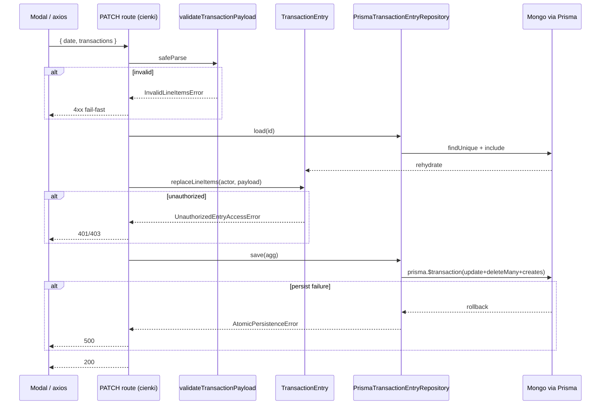

# Plan refaktoru — niezmiennik atomowości zapisu transakcji

> Produkt: **plan refaktoru**, nie implementacja. Metoda: odkrycie → identyfikacja → klasyfikacja → diagnoza → projekt.

**Powiązane artefakty:** [`01-domain-distillation.md`](./01-domain-distillation.md) · [`../changes/refactor-opportunities/research.md`](../changes/refactor-opportunities/research.md)

---

## KROK 0 — Kontekst

### Źródła wymagań

| Dokument | Status | Istotne sekcje |
|----------|--------|----------------|
| `context/foundation/prd.md` | **BRAK** | — |
| `context/foundation/tech-stack.md` | **BRAK** | — |
| `README.md` | **TAK** | wizja, features, stack, roadmap |
| `context/domain/01-domain-distillation.md` | **TAK** | niezmienniki I1–I16, ranking refaktoru |
| `context/changes/edit-transaction-analysis/research.md` | **TAK** | trace e2e, luki testów, dług PATCH |

**Ograniczenie:** brak formalnego PRD. Reguły biznesowe wyciągnięto z README (cele produktu), destylacji domeny i weryfikacji kodu zapisu transakcji.

### Cele produktu istotne dla niezmienników

| Cel (README) | Implikacja domenowa |
|--------------|---------------------|
| „simplified expense report app" — `README.md:2` | Transakcja = nagłówek + pozycje; integralność sumy jest rdzeniem |
| „Adding, editing and deleting transactions" — `README.md:26` | Każda mutacja musi zachować spójność nagłówek ↔ pozycje |
| „Tracking of personal expenses" + group budgets — `README.md:6-7`, `:23` | Ta sama reguła atomowości obowiązuje w 4 kwadrantach (personal/group × expense/income) |
| „Data validation in the backend using Zod" (roadmap) — `README.md:53` | Walidacja ma być po stronie serwera, nie tylko UI |

### Stack i warstwy logiki biznesowej

| Warstwa | Ścieżka | Rola względem niezmienników |
|---------|---------|----------------------------|
| Persystencja | `prisma/schema.prisma` | Model parent + `*Product`; brak constraintów atomowości |
| Zapis (REST) | `app/api/transaction/**` | **Jedyne miejsce mutacji** — inline walidacja + sekwencja Prisma |
| Odczyt | `actions/get*ById.ts`, `actions/get*Expenses.ts` | Konwersja `/100`; group read bez membership |
| Walidacja UI | `utils/formValidations.ts` | `TransactionSchema` — tylko modale |
| UI | `components/transaction-modal/` | Zod + axios; brak gwarancji atomowości |
| Typy | `types/types.ts` | DTO `Transaction` — brak logiki domenowej |

Runner testów: **Vitest** (`npm test`) — `package.json:11`, `vitest.config.ts:7-10`. E2E: **Playwright** (`npm run test:e2e`). CI **nie uruchamia testów** — `context/changes/refactor-opportunities/research.md:74`.

---

## KROK 1 — Identyfikacja niezmienników biznesowych

Poniższe reguły **MUSZĄ** być zawsze prawdziwe. Źródło: dokument lub kod.

### Rdzeń — transakcja (nagłówek + pozycje)

| ID | Niezmiennik | Źródło |
|----|-------------|--------|
| **INV-1** | Suma nagłówka (grosze) = suma pozycji ×100; wydatek — znak ujemny na nagłówku | `app/api/transaction/personal/expense/route.ts:63-66`; PATCH `:82-85` |
| **INV-2** | Każda pozycja ma kwotę dodatnią (> 0 w API, ≥ 0.01 PLN w UI) | API: `route.ts:38-42`; UI: `utils/formValidations.ts:50` |
| **INV-3** | Transakcja ma co najmniej jedną pozycję | `app/api/transaction/personal/expense/route.ts:20-22` |
| **INV-4** | Każda pozycja ma niepusty tytuł (po normalizacji) | `app/api/transaction/personal/expense/route.ts:29-35` |
| **INV-5** | Każda pozycja wskazuje istniejącą kategorię w katalogu | `app/api/transaction/personal/expense/route.ts:45-55` |
| **INV-6** | **Zapis nagłówka i pozycji jest atomowy** — albo wszystkie zmiany są persystowane, albo żadna (fail-fast, bez partial state) | Implikacja INV-1–5 + wzorzec replace (`update → deleteMany → create`); **brak egzekucji** — patrz KROK 2 |
| **INV-7** | Przychód: nagłówek dodatni; wydatek: nagłówek ujemny (konwencja znaku) | expense POST `:63-66` (ujemny); income — analogiczny wzorzec dodatni w `personal/income/route.ts` |
| **INV-8** | Data transakcji jest wymagana | `app/api/transaction/personal/expense/route.ts:21-23` |

### Dostęp — personal / group

| ID | Niezmiennik | Źródło |
|----|-------------|--------|
| **INV-9** | Personal: tylko właściciel (`userId`) czyta i mutuje swoją transakcję | `actions/getPersonalExpenseById.ts:15-18`; PATCH `:64-68` |
| **INV-10** | Group create: tylko owner lub member budżetu | `app/api/transaction/group/[groupBudgetId]/expense/route.ts:77-81` |
| **INV-11** | Group mutate (PATCH/DELETE): tylko autor transakcji (`userId`) | `app/api/transaction/group/.../expense/[transactionId]/route.ts:68-69` |
| **INV-12** | Group read: transakcja widoczna tylko dla uczestnika budżetu (owner lub member) | README: „Controlling access to data based on roles" — `README.md:21`; **naruszane** — `actions/getGroupExpenseById.ts:15-18` |

### Supporting / Generic

| ID | Niezmiennik | Źródło |
|----|-------------|--------|
| **INV-13** | Tylko owner budżetu zaprasza i usuwa członków | `app/api/transaction/group/[groupBudgetId]/member/route.ts:29-30` |
| **INV-14** | Max 10 wywołań AI / dzień kalendarzowy | `README.md:7`; `app/api/ai/route.ts:60-65` |
| **INV-15** | Usunięcie członka anonimizuje jego transakcje w budżecie | `app/api/transaction/group/.../member/[inviteId]/route.ts:64-72` |

---

## KROK 2 — Klasyfikacja i wybór #1

### Macierz oceny (skala 1–5)

| ID | (a) Rdzeniowość | (b) Rozsmarowanie | (c) Egzekucja | Uwaga |
|----|:---------------:|:-----------------:|:-------------:|-------|
| **INV-6** atomowość zapisu | **5** — bez tego raport wydatków traci wiarygodność (`README.md:2`) | **5** — 8 route'ów POST/PATCH, ten sam wzorzec skopiowany | **1** — **nigdy** nie egzekwowany; brak `$transaction` w całym repo (grep → 0) | Partial failure = nagłówek zaktualizowany, pozycje usunięte/częściowe |
| INV-1 suma nagłówek=pozycje | 5 | 5 (8 route + 19 plików konwersji) | 3 — liczone przy każdym zapisie, ale bez weryfikacji po fakcie | Podlega INV-6 |
| INV-2 dodatnia kwota pozycji | 5 | 5 (8 API + 3 modale UI) | 3 — API+UI, rozjazd progu 0 vs 0.01 | UI nie jest strażnikiem serwera |
| INV-12 group read membership | 4 — „roles" w README | 2 — 2× `getGroup*ById` | **1** — **naruszalny** (read bez filtra) | Luka bezpieczeństwa, węższy zakres niż INV-6 |
| INV-9 personal ownership | 4 | 3 | 4 — spójne read+write | Dobrze egzekwowany |
| INV-14 limit AI | 4 (wyróżnik OCR) | 1 — `app/api/ai/route.ts` | 4 — egzekowany w jednym miejscu | Poza ścieżką zapisu transakcji |
| INV-13 owner-only invite | 3 (supporting) | 2 | 4 | Stabilny |

**Legenda (c):** 5 = zawsze egzekowany + testowany · 3 = egzekowany niespójnie · 1 = ignorowany lub aktywnie naruszalny

### Wybór #1: **INV-6 — Atomowość zapisu transakcji (nagłówek + pozycje)**

**Uzasadnienie wyboru:**

1. **Najwyższa rdzeniowość (a=5):** Produkt to aplikacja raportów wydatków oparta na pozycjach z paragonów (`README.md:2-7`). Niespójny stan (nagłówek bez pozycji lub odwrotnie) bezpośrednio psuje raport — to definiuje sens produktu, nie infrastrukturę.

2. **Najsłabsza egzekucja (c=1):** Wzorzec `update/create → deleteMany → pętla create` wykonuje **3+ osobne** operacje Prisma bez opakowania transakcyjnego. Grep `$transaction` w repo: **0 wyników**. Przy błędzie w pętli `create` system **nie rollbackuje** — kontynuuje lub zostawia partial state; route zwraca sukces dopiero po pełnej sekwencji, ale **nie ma mechanizmu cofnięcia** wcześniejszych kroków.

3. **Pokrywa INV-1–5 jako pakiet:** Agregat-strażnik dla INV-6 naturalnie centralizuje walidację pozycji i sumę — jeden punkt fail-fast zamiast 8 kopii inline checks.

4. **Dlaczego nie INV-12:** Równie słaba egzekucja (c=1), ale węższy zakres (2 pliki read) i dotyczy dostępu, nie integralności pieniężnej. INV-12 planuje się jako **faza równoległa** w metodzie `assertCanView` agregatu/repozytorium — nie konkuruje z INV-6 o pierwszeństwo refaktoru strukturalnego.

---

## KROK 3 — Diagnoza INV-6

### Reguła

> **Przy create lub update transakcji persystencja nagłówka i wszystkich pozycji musi być atomowa. Nielegalny stan pośredni (nagłówek zaktualizowany, pozycje usunięte, create nieukończony) nie może istnieć. Operacja kończy się błędem domenowym, nie cichym partial success.**

### Gdzie reguła dziś „żyje" (bez egzekucji atomowości)

#### Warstwa API — create (4 route'y)

| Plik | Sekwencja | Linie |
|------|-----------|-------|
| `app/api/transaction/personal/expense/route.ts` | `create` parent → pętla `create` products | `:59-79` |
| `app/api/transaction/personal/income/route.ts` | ten sam wzorzec | `:59-79` (analogicznie) |
| `app/api/transaction/group/[groupBudgetId]/expense/route.ts` | `create` parent → pętla `create` | `:84-106` |
| `app/api/transaction/group/[groupBudgetId]/income/route.ts` | ten sam wzorzec | analogicznie |

**Ryzyko create:** Parent utworzony (`:59-68`), błąd w 2. iteracji pętli (`:70-78`) → osierocony nagłówek bez pozycji (łamie INV-3).

#### Warstwa API — update (4 route'y)

| Plik | Sekwencja | Linie |
|------|-----------|-------|
| `app/api/transaction/personal/expense/[transactionId]/route.ts` | `update` → `deleteMany` → pętla `create` | `:75-104` |
| `app/api/transaction/personal/income/[transactionId]/route.ts` | j.w. | analogicznie |
| `app/api/transaction/group/.../expense/[transactionId]/route.ts` | j.w. | `:72-100` |
| `app/api/transaction/group/.../income/[transactionId]/route.ts` | j.w. | analogicznie |

**Ryzyko update:** Po `:89-93` (`deleteMany`) wszystkie pozycje usunięte; błąd w `:95-103` → nagłówek ze starą/nową sumą (`:75-86`) **bez pozycji** — najgorszy partial state.

#### Warstwa walidacji — rozproszona, nie atomowa

| Warstwa | Plik | Rola | Linie |
|---------|------|------|-------|
| UI | `utils/formValidations.ts` | `TransactionSchema` — blokuje submit w kliencie | `:44-54` |
| UI | `components/transaction-modal/add-expense.tsx` | `zodResolver(TransactionSchema)` | `:73-74` |
| UI | `components/transaction-modal/edit-transaction.tsx` | j.w. | `:141` |
| API | 8× route POST/PATCH | Inline checks (date, empty, title, value, category) | np. `personal/expense/[transactionId]/route.ts:21-56` |

**Rozjazd:** API **nie importuje** `TransactionSchema` — jedyny import z `formValidations` w transaction API to `CreateBudgetFormSchema` (`group/route.ts:8`). Klient może ominąć UI i wysłać PATCH bezpośrednio.

#### Warstwa odczytu — nie naprawia partial state

| Plik | Zachowanie | Linie |
|------|------------|-------|
| `actions/getPersonalExpenseById.ts` | `include: { transactions: true }` — zwraca co jest w DB, bez walidacji INV-6 | `:20-22` |
| `actions/getGroupExpenseById.ts` | j.w. | `:19-21` |
| `components/transaction-modal/edit-transaction.tsx` | `get*ById` zwraca `null` → modal pusty, **bez błędu** | `:115-121` |

#### Warstwa persystencji — brak constraintu DB

| Plik | Uwaga |
|------|-------|
| `prisma/schema.prisma` | Relacja parent→products z `onDelete: Cascade`; **brak** wymogu min. 1 product, **brak** transakcji aplikacyjnej |

### Mapa luk egzekucji

| Problem | Gdzie | Dowód |
|---------|-------|-------|
| Brak transakcji DB | Wszystkie 8 route'ów zapisu | grep `$transaction` → 0; PATCH `:75-104` |
| UI jako jedyny strażnik walidacji | Modale add/edit | `TransactionSchema` tylko w UI; brak w `app/api/transaction` |
| Błąd połykany zamiast fail-fast (read) | `getGroupExpenseById.ts` | `catch { return null }` — `:38-40` |
| Cichy failure load edit | `edit-transaction.tsx` | Brak toast gdy `transaction` null — `:115-121` |
| Brak testów integralności | Cały projekt | 0 testów PATCH/API — `edit-transaction-analysis/research.md:214-215` |
| Sukces HTTP mimo ryzyka partial | Route zwraca 200 dopiero po pełnej pętli, ale bez rollback | `:106` — sukces nie implikuje atomowości przy mid-sequence crash |

---

## KROK 4 — Projekt agregatu-strażnika

### Granica agregatu (odkryta ze schema)

**Root:** rekord nagłówka (`PersonalExpenses` | `PersonalIncomes` | `GroupExpenses` | `GroupIncomes`)  
**Encje wewnętrzne:** kolekcja pozycji (`*Product`) — mutowalna wyłącznie przez root.

W kodzie UI/DTO pozycja to `Transaction` — `types/types.ts:12-17`. Agregat enkapsuluje **nagłówek + pozycje** jako jedną jednostkę spójności.

### Lokalizacja proponowana (nowa warstwa domeny)

```
domain/
  transaction-entry/
    TransactionEntry.ts          # aggregate root
    LineItem.ts                  # value object
    MoneyAmount.ts               # grosze, konwersja PLN
    TransactionEntryKind.ts      # personal|group × expense|income
    errors/
      TransactionEntryError.ts   # bazowy
      AtomicPersistenceError.ts
      InvalidLineItemsError.ts
      UnauthorizedEntryAccessError.ts
    TransactionEntryRepository.ts  # port
    PrismaTransactionEntryRepository.ts  # adapter (infra)
    validateTransactionPayload.ts  # wspólny kontrakt UI+API (INV-2–5, INV-8)
```

### Błędy domenowe (fail-fast)

```typescript
// domain/transaction-entry/errors/TransactionEntryError.ts
export class TransactionEntryError extends Error {
  constructor(
    readonly code: string,
    message: string,
  ) {
    super(message);
  }
}

export class InvalidLineItemsError extends TransactionEntryError { /* INV-2,3,4,5,8 */ }
export class HeaderLineItemsMismatchError extends TransactionEntryError { /* INV-1,7 */ }
export class AtomicPersistenceError extends TransactionEntryError { /* INV-6 */ }
export class UnauthorizedEntryAccessError extends TransactionEntryError { /* INV-9,10,11,12 */ }
```

Każda nielegalna operacja **rzuca** — route mapuje na HTTP 4xx; **nigdy** `return null` / partial persist.

### Agregat — sygnatury i pseudokod

```typescript
// domain/transaction-entry/TransactionEntry.ts

type TransactionEntryId = string;
type ActorId = string;

interface ReplaceLineItemsCommand {
  date: Date;
  lineItems: LineItemDraft[];  // title, amountPln, categoryId
}

class TransactionEntry {
  private constructor(
    readonly id: TransactionEntryId,
    readonly kind: TransactionEntryKind,
    private headerGrosze: number,
    private date: Date,
    private lines: LineItem[],
    readonly ownerUserId: ActorId | null,      // personal / group author
    readonly groupBudgetId?: string,
  ) {}

  /** Factory — create (INV-1,2,3,4,5,7,8) */
  static create(
    kind: TransactionEntryKind,
    actor: ActorId,
    cmd: ReplaceLineItemsCommand,
    catalog: CategoryCatalog,
    access: EntryAccessPolicy,
  ): TransactionEntry {
    access.assertCanCreate(kind, actor, cmd.groupBudgetId);
    const lines = LineItem.fromDrafts(cmd.lineItems, catalog); // throws InvalidLineItemsError
    const headerGrosze = HeaderAmount.fromLines(lines, kind.isExpense); // throws on empty
    return new TransactionEntry(
      /* newId */ crypto.randomUUID(),
      kind,
      headerGrosze,
      cmd.date,
      lines,
      actor,
      cmd.groupBudgetId,
    );
  }

  /** Mutacja — replace all lines (INV-6 enforced by repository, not here) */
  replaceLineItems(
    actor: ActorId,
    cmd: ReplaceLineItemsCommand,
    catalog: CategoryCatalog,
    access: EntryAccessPolicy,
  ): void {
    access.assertCanMutate(this, actor);           // throws UnauthorizedEntryAccessError
    if (!cmd.date) throw new InvalidLineItemsError('DATE_REQUIRED');
    const newLines = LineItem.fromDrafts(cmd.lineItems, catalog);
    this.lines = newLines;
    this.headerGrosze = HeaderAmount.fromLines(newLines, this.kind.isExpense);
    this.date = cmd.date;
    // invariant: this.lines.length >= 1 && sum(lines) === abs(header)
    this.assertInvariants();
  }

  private assertInvariants(): void {
    if (this.lines.length === 0)
      throw new InvalidLineItemsError('AT_LEAST_ONE_LINE');
    const sum = this.lines.reduce((a, l) => a + l.grosze, 0);
    const expected = this.kind.isExpense ? -sum : sum;
    if (this.headerGrosze !== expected)
      throw new HeaderLineItemsMismatchError(/* INV-1 */);
  }

  toPersistence(): { header: HeaderRow; products: ProductRow[] } { /* map */ }
}
```

### Repozytorium — jedyna brama persystencji (INV-6)

```typescript
// domain/transaction-entry/TransactionEntryRepository.ts

interface TransactionEntryRepository {
  load(id: TransactionEntryId, kind: TransactionEntryKind): Promise<TransactionEntry | null>;
  save(entry: TransactionEntry): Promise<void>;   // create OR update — caller nie rozróżnia
  remove(entry: TransactionEntry, actor: ActorId): Promise<void>;
}

// infra/PrismaTransactionEntryRepository.ts — pseudokod save (update path)

async save(entry: TransactionEntry): Promise<void> {
  const { header, products } = entry.toPersistence();
  try {
    await prisma.$transaction(async (tx) => {
      await tx.personalExpenses.update({ where: { id: header.id }, data: header }); // table per kind
      await tx.personalExpenseProduct.deleteMany({ where: { personalExpenseId: header.id } });
      for (const p of products) {
        await tx.personalExpenseProduct.create({ data: p });
      }
    });
  } catch (cause) {
    throw new AtomicPersistenceError('SAVE_FAILED', { cause }); // fail-fast, no partial expose
  }
}
```

**Create path** analogicznie: `$transaction` obejmuje `create` parent + wszystkie `create` products.

**Load:** jedno zapytanie `findUnique` + `include: { transactions: true }` → rehydrate agregatu → `assertInvariants()` przy load (wykrywa historyczny partial state — opcjonalnie log + reject).

### Cienkie API/route (docelowy kształt)

```typescript
// app/api/transaction/personal/expense/[transactionId]/route.ts — AFTER (szkic)

export async function PATCH(req: Request, { params }) {
  const actor = await requireCurrentUser(); // 401 jeśli brak
  const body = await req.json();

  let payload;
  try {
    payload = validateTransactionPayload(body); // wspólny Zod — INV-2,3,4,8
  } catch (e) {
    return mapDomainError(e); // 404/400
  }

  const repo = getTransactionEntryRepository();
  const entry = await repo.load(params.transactionId, kind.personalExpense);
  if (!entry) throw new UnauthorizedEntryAccessError(/* INV-9 */);

  try {
    entry.replaceLineItems(actor.id, payload, categoryCatalog, accessPolicy);
    await repo.save(entry); // INV-6 — atomowo
  } catch (e) {
    return mapDomainError(e); // AtomicPersistenceError → 500, Invalid* → 404, Unauthorized → 401/403
  }

  return NextResponse.json('Zaktualizowano transakcję');
}

function mapDomainError(e: TransactionEntryError): NextResponse {
  // jawne mapowanie — nigdy ciche połykanie
}
```

**Przeniesienie egzekucji z klienta:** `TransactionSchema` zostaje dla UX (wczesna walidacja), ale **jedynym strażnikiem** mutacji staje `validateTransactionPayload` + metody agregatu + `repo.save` w `$transaction`.

### EntryAccessPolicy (INV-9,10,11,12 w jednym miejscu)

```typescript
assertCanCreate(kind, actor, groupBudgetId?)  // INV-10
assertCanMutate(entry, actor)                 // INV-9 personal, INV-11 group
assertCanView(entry, actor)                 // INV-9, INV-12 — naprawa read group
```

---

## KROK 5 — Before/after, plan faz, testy

### Before / after — miejsca reguły INV-6

| Miejsce | BEFORE (dziś) | AFTER (docelowo) |
|---------|---------------|------------------|
| `personal/expense/route.ts:59-79` | create + loop, brak `$transaction` | `TransactionEntry.create` → `repo.save` w `$transaction` |
| `personal/expense/[transactionId]/route.ts:75-104` | update → deleteMany → loop | `entry.replaceLineItems` → `repo.save` w `$transaction` |
| 6 pozostałych route POST/PATCH | kopia wzorca | delegacja do wspólnego `TransactionEntryService` |
| `utils/formValidations.ts:44-54` | tylko UI | `validateTransactionPayload` importowany przez UI **i** API |
| `actions/get*ById.ts` | zwraca partial state bez alarmu | load przez repo + opcjonalnie `assertInvariants` / reject corrupt |
| `edit-transaction.tsx:115-121` | null → pusty modal | błąd domenowy → toast error (fail-fast UX) |
| `getGroupExpenseById.ts:38-40` | `catch → null` | propagacja `TransactionEntryError` / 403 |

### Plan faz refaktoru

| Faza | Cel | Test-first? | Zakres |
|:----:|-----|:-----------:|--------|
| **0** | Baseline | E2E manual | Uruchomić `e2e/personal-budget.spec.ts`, `e2e/group-budget.spec.ts` — punkt odniesienia |
| **1** | Udowodnić podatność INV-6 | **TAK** (Vitest) | Test integracyjny: mock Prisma — `deleteMany` OK, 2. `create` throw → stan sprzed operacji |
| **2** | Warstwa domeny | **TAK** (Vitest) | `TransactionEntry`, `LineItem`, błędy, `assertInvariants` — pure unit, bez DB |
| **3** | `validateTransactionPayload` | **TAK** (Vitest) | Wspólny kontrakt; przypadki INV-2,3,4,8; date coercion dla API |
| **4** | Repozytorium | **TAK** (Vitest + mock Prisma) | `save` opakowane w `$transaction`; test rollback |
| **5** | Pierwszy route | **TAK** | Migracja **jednego** PATCH: `personal/expense/[transactionId]`; test route handler |
| **6** | Rollout | Test per route | Pozostałe 3 PATCH + 4 POST |
| **7** | Odczyt + access | **TAK** | `assertCanView` w repo.load; naprawa `getGroup*ById` (INV-12) |
| **8** | Cleanup | E2E | Usunięcie zduplikowanych inline checks z route'ów; CI: dodać `npm test` |

**Zależności:** 0 → 1 → 2 → 3 → 4 → 5 → 6; faza 7 równolegle po 4.

### Przypadki testowe dla INV-6 (legalne i nielegalne)

#### Vitest — agregat (faza 2)

| # | Scenariusz | Oczekiwany wynik |
|---|------------|------------------|
| T1 | `create` z 3 pozycjami, poprawne kategorie | Agregat; `headerGrosze === -sum(lines)` dla expense |
| T2 | `create` z pustą tablicą pozycji | `InvalidLineItemsError('AT_LEAST_ONE_LINE')` |
| T3 | pozycja `value: 0` | `InvalidLineItemsError` |
| T4 | `replaceLineItems` zmienia sumę | `headerGrosze` przeliczone; invariant OK |
| T5 | mismatch ręcznie ustawionego header vs lines | `HeaderLineItemsMismatchError` przy `assertInvariants` |

#### Vitest — repozytorium (faza 4)

| # | Scenariusz | Oczekiwany wynik |
|---|------------|------------------|
| T6 | `save` update — wszystkie kroki OK | `$transaction` wywołane 1×; 1× update, 1× deleteMany, N× create |
| T7 | `save` update — `create` #2 throw | `AtomicPersistenceError`; **zero** wywołań poza `$transaction` które commituje (rollback) |
| T8 | `save` create — parent OK, pierwszy product throw | brak osieroconego parent w DB (rollback) |

#### Vitest / integration — route (faza 5+)

| # | Scenariusz | Oczekiwany wynik |
|---|------------|------------------|
| T9 | PATCH legalny payload | 200; repo.save wywołane |
| T10 | PATCH omijający UI (pusta tablica) | 404/400; **brak** wywołania repo.save |
| T11 | PATCH bez auth | 401; brak mutacji DB |

#### Playwright E2E (faza 0 baseline + regresja po 6)

| # | Scenariusz | Oczekiwany wynik |
|---|------------|------------------|
| E1 | Edit expense — zmiana kwoty (istniejący) | Tabela odświeżona; kwota zgodna |
| E2 | Add expense — happy path | Nowy wiersz w tabeli |

### Nowe „load-bearing" nazwy (rejestr kontraktów)

Projekt **nie prowadzi** rejestru glossary (`context/foundation/glossary.md` — BRAK). Poniższe nazwy należy zarejestrować przy implementacji (np. w `context/foundation/glossary.md` lub sekcji AGENTS.md):

| Nazwa | Typ | Odpowiedzialność |
|-------|-----|------------------|
| `TransactionEntry` | Aggregate Root | Jedyny mutator nagłówek+pozycje; egzekwuje INV-1–8 |
| `LineItem` | Value Object | Pojedyncza pozycja w groszach |
| `TransactionEntryKind` | Value Object | Kwadrant personal/group × expense/income |
| `TransactionEntryRepository` | Port | Load/save/remove; INV-6 via `$transaction` |
| `validateTransactionPayload` | Domain Service | Wspólna walidacja wejścia UI+API |
| `EntryAccessPolicy` | Domain Service | INV-9,10,11,12 |
| `AtomicPersistenceError` | Domain Error | Fail-fast gdy persist nie atomowy |
| `InvalidLineItemsError` | Domain Error | INV-2,3,4,5,8 |
| `UnauthorizedEntryAccessError` | Domain Error | INV-9–12 |
| `TransactionEntryService` | Application Service | Orkiestracja route → agregat → repo |

---

## Diagram — przepływ docelowy



---

## Metadane planu

| Pole | Wartość |
|------|---------|
| Niezmiennik #1 | **INV-6** — atomowość zapisu nagłówek + pozycje |
| Agregat-strażnik | `TransactionEntry` |
| Pliki dziś dotknięte przez INV-6 | 8 route'ów w `app/api/transaction/**` (4 POST + 4 PATCH) |
| Runner test-first | Vitest (unit + mock integration); Playwright (regresja E2E) |
| Poza zakresem tego planu | Refaktor dual data path edit (C1), explicit transactionType (C6), statystyki (R10) |
