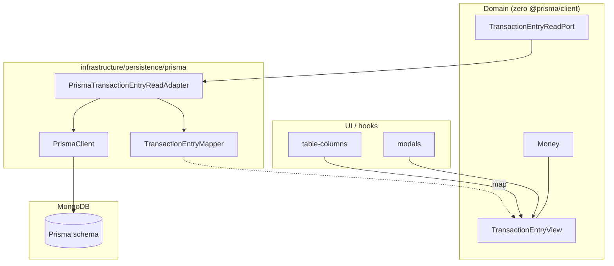

# Plan ACL — izolacja `@prisma/client`

> Produkt: **plan refaktoru**, nie implementacja. Metoda: odkrycie → identyfikacja → klasyfikacja → diagnoza → projekt ACL → weryfikacja.

**Powiązane artefakty:** [`01-domain-distillation.md`](./01-domain-distillation.md) · [`02-invariant-aggregate-refactor.md`](./02-invariant-aggregate-refactor.md) · [`../map/repo-map.md`](../map/repo-map.md)

---

## KROK 0 — Kontekst

### Dokumenty bazowe

| Dokument | Status | Istotne dla ACL |
|----------|--------|-----------------|
| `context/foundation/prd.md` | **BRAK** | — |
| `context/foundation/tech-stack.md` | **BRAK** | — |
| `README.md` | **TAK** | stack, roadmap walidacji |
| `context/map/artifact-2-structure.md` | **TAK** | warstwy, hub `types/types.ts` (fan-in 27) |
| `context/domain/02-invariant-aggregate-refactor.md` | **TAK** | repozytorium + mapper persystencji |

**Ograniczenie:** brak explicite „wymienialności ORM" w README. Sygnały pośrednie: MongoDB i Prisma wymienione **osobno** w stacku (`README.md:39-40`); roadmap deklaruje przeniesienie walidacji na backend Zod (`README.md:53`) — rozjazd z transakcyjnymi route'ami API (patrz LEAK-3).

### Stack i zależności zewnętrzne (manifest)

Źródło: `package.json:17-58`.

| Pakiet | Wersja | Rola deklarowana |
|--------|--------|------------------|
| `@prisma/client` / `prisma` | ^5.13.0 | ODM MongoDB |
| `next` / `react` | 14.2.3 / ^18 | UI + API routes |
| `axios` | ^1.6.8 | HTTP klient (UI → API) |
| `zod` | ^3.23.6 | Walidacja formularzy |
| `openai` | ^4.45.0 | AI paragonów (serwer) |
| `tesseract.js` | ^5.0.5 | OCR (klient) |
| `@tanstack/react-query` | ^5.40.1 | Cache odczytów UI |
| `react-day-picker` | ^8.10.1 | Kalendarz UI |
| `date-fns` | ^3.6.0 | Format dat |
| `next-auth` (+ adapter prisma) | via `@next-auth/prisma-adapter` | Sesja |

### Warstwy kodu

```
persystencja (schema)     prisma/schema.prisma
infra runtime             lib/prisma.ts
API mutacji               app/api/**
server actions (odczyt)   actions/**
kontrakt współdzielony    types/types.ts          ← hub, importuje @prisma/client
utils                     utils/**
hooks                     hooks/**
UI                        components/**, app/(root)/**
reducers/contexts         reducers/, contexts/
```

Reguły dependency-cruiser (` .dependency-cruiser.js:12-35`) **nie zabraniają** importu `@prisma/client` w UI — brak reguły „components-not-importing-prisma". Graf jest acykliczny, ale **gwiaździsty** wokół `types/types.ts` — `artifact-2-structure.md:39-45`.

---

## KROK 1 — Identyfikacja przeciekających zależności

### LEAK-1 — `@prisma/client` (typy ORM w UI, utils, hub typów)

**Sygnały:** ten sam pakiet w `types/`, `utils/`, `hooks/`, `'use client'` komponentach; typy persistence w sygnaturach tabel/wykresów; `Modified*` = intersection z modelami Prisma.

| Plik | Linia | Import / użycie |
|------|------:|-----------------|
| `lib/prisma.ts` | 1 | `PrismaClient` — **dozwolone (runtime infra)** |
| `types/types.ts` | 1-9 | `GroupBudget`, `GroupExpenses`, `GroupIncomes`, `InviteNotification`, `PersonalExpenses`, `PersonalIncomes`, `User` |
| `utils/categoryUtils.ts` | 1 | `ExpenseCategory`, `IncomeCategory` |
| `utils/chartUtils.ts` | 11 | `ExpenseCategory`, `IncomeCategory` |
| `hooks/useBudgetMember.ts` | 8 | `User` |
| `hooks/useGroupExpensesByUserId.ts` | 8 | `GroupExpenses` |
| `components/transaction-modal/ui/transaction-category-select.tsx` | 21 | `ExpenseCategory`, `IncomeCategory` |
| `app/(root)/(routes)/personal/components/table-columns.tsx` | 16 | `PersonalExpenses`, `PersonalIncomes` |
| `app/(root)/(routes)/group/[id]/components/table-columns.tsx` | 17 | `GroupExpenses`, `GroupIncomes` |
| `app/(root)/(routes)/group/[id]/page.tsx` | 11 | `GroupBudget` |
| `app/(root)/(routes)/group/components/budget.tsx` | 15 | `GroupBudgetMember` |
| `app/(root)/(routes)/statistics/personal/components/chart.tsx` | 9 | `ExpenseCategory`, `IncomeCategory` |
| `app/(root)/(routes)/statistics/[budgetId]/components/chart.tsx` | 9 | `ExpenseCategory`, `IncomeCategory` |

**Dodatkowo:** **37 plików** importuje `prisma` runtime z `@/lib/prisma` (actions + app/api + auth) — poprawna warstwa infra, ale **bez mappera** zwracają/w przyjmują kształt Prisma bezpośrednio do konsumentów.

### LEAK-2 — `react-day-picker` (`DateRange` w server actions)

**Sygnał:** typ biblioteki UI w sygnaturach `'use server'` actions i w hubie `types/types.ts`.

| Plik | Linia |
|------|------:|
| `types/types.ts` | 10, 88 |
| `actions/getPersonalExpenses.ts` | 7, 9 |
| `actions/getPersonalIncomes.ts` | 7, 9 |
| `actions/getGroupExpenses.ts` | 7, 9 |
| `actions/getGroupIncomes.ts` | 7, 9 |
| `actions/getGroupBudgetsStatistics.ts` | 7, 9 |
| `actions/getGroupExpensesByUserId.ts` | 7, 10 |
| `reducers/transaction-modal-reducer.ts` | 1, 34 |
| `components/shared/date-picker.tsx` | 12, 15-16 |
| `components/shared/actions-panel.tsx` | 11, 22 |
| `components/ui/calendar.tsx` | 5 |
| `app/(root)/(routes)/statistics/personal/components/charts-container.tsx` | 16, 19, 34 |
| `app/(root)/(routes)/statistics/[budgetId]/components/charts-container.tsx` | 16, 23, 40 |

### LEAK-3 — `zod` (walidacja rozszczepiona UI ↔ API)

**Sygnał:** wspólny moduł `formValidations.ts`, ale **8 route'ów transakcji** używa inline checks zamiast Zod; roadmap mówi „backend using Zod".

| Warstwa | Pliki znające Zod | Linie |
|---------|-------------------|-------|
| Definicje | `utils/formValidations.ts` | 1, 3-54 |
| UI | `add-expense.tsx` | 17, 74 |
| UI | `add-income.tsx` | 16, 67 |
| UI | `edit-transaction.tsx` | 24, 141 |
| UI | `register-form.tsx`, `login-form.tsx`, `new-budget.tsx`, `members-dialog.tsx` | import `* as z` / schemas |
| API (częściowo) | `app/api/register/route.ts` | 10, 18 |
| API (częściowo) | `app/api/transaction/group/route.ts` | 8, 19 |
| API (brak) | 8× POST/PATCH transakcji | inline `:21-56` — np. `personal/expense/[transactionId]/route.ts:21-56` |

### LEAK-4 — `axios` (SDK HTTP po obu stronach granicy klient/serwer)

**Sygnał:** UI woła REST bezpośrednio; server actions istnieją równolegle dla odczytu (dual path — `edit-transaction-analysis/research.md`).

| Plik | Linia |
|------|------:|
| `components/transaction-modal/edit-transaction.tsx` | 3, 185-193 |
| `components/transaction-modal/add-expense.tsx` | 3, 128, 162 |
| `components/transaction-modal/add-income.tsx` | 3, 106 |
| `components/dialog/delete-transaction.tsx` | 3 |
| `components/dialog/new-budget.tsx` | 4 |
| `components/dialog/members-dialog.tsx` | 4 |
| `components/shared/notification.tsx` | 3 |
| `app/(auth)/(routes)/auth/components/register-form.tsx` | 5 |
| `app/(auth)/(routes)/activate/[id]/page.tsx` | 3 |

### LEAK-5 — Konwersja grosze/PLN (logika domenowa zduplikowana, brak typu)

**Sygnał:** ten sam wzorzec `/100` i `*100` w actions, API, utils — **19 plików** (research V19); nie pakiet npm, ale **kształt persystencji Prisma (`Int`)** przecieka do wszystkich warstw.

Przykłady: `actions/getPersonalExpenseById.ts:29-36`, `app/api/transaction/personal/expense/route.ts:63-66`, `utils/chartUtils.ts:40`.

### LEAK-6 — `openai` / `tesseract.js` (granice częściowo OK)

| Pakiet | Warstwa | Pliki | Ocena |
|--------|---------|-------|-------|
| `openai` | tylko API | `app/api/ai/route.ts:1` | **Izolowane** |
| `tesseract.js` | tylko UI | `components/transaction-modal/ui/file-input.tsx:3` | **Izolowane** (OCR celowo po stronie klienta) |

---

## KROK 2 — Klasyfikacja i wybór #1

Skala 1–5 (wyżej = gorzej / większy wpływ).

| ID | (a) Warstwy / pliki | (b) Koszt wymiany dziś | (c) Rozjazd intencja↔kod | Suma ryzyka |
|----|:-------------------:|:----------------------:|:------------------------:|:-----------:|
| **LEAK-1 `@prisma/client`** | **5** — 13 importów typów + 37 runtime + hub fan-in 27 | **5** — zmiana ODM/DB dotyka typów tabel, wykresów, hooków, actions | **4** — MongoDB≠Prisma w README; brak ACL mimo osobnej warstwy schema | **★ NAJWYŻSZY** |
| LEAK-2 `react-day-picker` | 4 — 14 plików, actions+types | 3 — wymiana kalendarza wymaga typów w actions | 3 — UI lib w `'use server'` | Wysoki |
| LEAK-3 `zod` | 3 — UI+2 API vs 8 route bez | 3 — utrzymanie driftu | **5** — README roadmap `:53` vs kod transakcji | Wysoki (częściowo w planie C2) |
| LEAK-4 `axios` | 3 — 9 komponentów UI | 2 — wymiana na fetch/RSC | 2 — brak deklaracji wymienialności | Średni |
| LEAK-5 grosze/PLN | 5 — 19 plików | 4 — każda zmiana storage | 4 — `Int` w schema świadome, mapowanie nie | Wysoki (element LEAK-1) |

### Wybór #1: **LEAK-1 — `@prisma/client`**

**Uzasadnienie:**

1. **Najszerszy przeciek:** jedyne zależność obecne jednocześnie w `types/` (hub całego repo), `utils/`, `hooks/`, komponentach `'use client'` i pośrednio we wszystkich `actions/` przez brak mapperów.

2. **Najwyższy koszt wymiany:** `ColumnDef<PersonalExpenses | PersonalIncomes>` — `table-columns.tsx:72` wiąże tabelę React bezpośrednio ze schematem Mongo; wymiana Prisma/Mongo wymaga dziś dotknięcia UI wykresów, selectów kategorii i 4 typów `Modified*`.

3. **Rozjazd architektoniczny:** `artifact-2-structure.md` traktuje `types/types.ts` jako kontrakt domenowy (liść, fan-in 27), ale plik importuje modele persistence (`types/types.ts:1-9`) — **kontrakt wire = kształt bazy**, nie model domenowy.

4. **LEAK-5 jest podrzędny:** duplikacja `/100`/`×100` wynika z braku value objecta za mapowaniem Prisma `Int`; ACL dla LEAK-1 naturalnie domyka LEAK-5 przez `Money`.

5. **Synergia z planem 02:** `TransactionEntryRepository` + mapper w infra to ten sam katalog ACL — jeden refactor, dwa cele (niezmiennik + izolacja).

---

## KROK 3 — Diagnoza LEAK-1

### Duplikacja kształtu persistence w wielu warstwach

**Hub typów = aliasy Prisma:**

```31:45:types/types.ts
export type ModifiedPersonalExpense = PersonalExpenses & {
  transactions: Transaction[];
};
// … ModifiedPersonalIncome, ModifiedGroupExpense, ModifiedGroupIncome
```

Konsumenci hubu (przykłady): modale edit (`edit-transaction.tsx` przez `Modified*`), listy hooks, tabele — **27 importerów** (`artifact-2-structure.md:43`).

**UI `'use client'` z typami ORM:**

```1:16:app/(root)/(routes)/personal/components/table-columns.tsx
'use client';
…
import { PersonalExpenses, PersonalIncomes } from '@prisma/client';
```

```72:72:app/(root)/(routes)/personal/components/table-columns.tsx
export const columns: ColumnDef<PersonalExpenses | PersonalIncomes>[] = [
```

Tabela operuje na polach persistence (`value` jako `Int` grosze w DB vs `/100` tylko w niektórych actions) — UI musi **wiedzieć** o konwencji storage.

**Utils z typem Prisma w sygnaturze:**

```1:11:utils/categoryUtils.ts
import { ExpenseCategory, IncomeCategory } from '@prisma/client';

export const getCategoryName = (
  categories: ExpenseCategory[] | IncomeCategory[],
  categoryId: string,
) => {
```

**Wykresy — ten sam przeciek:**

```9:9:app/(root)/(routes)/statistics/personal/components/chart.tsx
import { ExpenseCategory, IncomeCategory } from '@prisma/client';
```

### Przeciek przez granice (groźne miejsca)

| Granica | Problem | Dowód |
|---------|---------|-------|
| Persistence → Kontrakt | `types/types.ts` re-eksportuje modele DB | `:1-9`, `:31-57` |
| Kontrakt → UI klienta | `'use client'` import `@prisma/client` | `table-columns.tsx:1`, `:16` |
| Persistence → Utils | `categoryUtils` zna `ExpenseCategory` ORM | `categoryUtils.ts:1-8` |
| Actions → UI bez mapowania | Actions zwracają obiekty z `/100` ad hoc, typ nadal Prisma-based | `getPersonalExpenses.ts:37-40` + typ listy z Prisma |
| Schema `Int` → API → UI | Konwersja rozproszona, nie w ACL | 19 plików `/100`/`×100` |

**Uwaga bundler:** import **typów** `@prisma/client` w `'use client'` zwykle erasure-only, ale coupling sprawia, że refaktor schema (np. rename pola) **łamie kompilację UI** — efekt jak wciągnięcie SDK do klienta.

### Rozjazd intencja ↔ kod

| Deklaracja | Kod | Dowód |
|------------|-----|-------|
| MongoDB **i** Prisma jako osobne pozycje stacku — implikuje warstwę persistence | UI importuje `@prisma/client` | `README.md:39-40` vs `table-columns.tsx:16` |
| `types/` jako liść kontraktu (`types-not-importing-up`) | `types/` importuje ORM + `react-day-picker` | `.dependency-cruiser.js:13-20`, `types/types.ts:1-10` |
| Roadmap: walidacja backend Zod | Osobny temat (LEAK-3), ale ten sam root cause — brak warstwy aplikacji między wire a domain | `README.md:53` |

---

## KROK 4 — Projekt ACL

### Zasada

**Jedyna wiedza o `@prisma/client`:** katalog `infrastructure/persistence/prisma/`. Reszta kodu używa **read modeli domenowych** i **portów repozytoriów**.

### Value objects / encje domenowe (bez importu Prisma)

```typescript
// domain/money/Money.ts — JEDYNE miejsce wiedzy o groszach i znaku expense/income

export class Money {
  private constructor(readonly grosze: number) {}

  static fromPln(pln: number): Money;
  static fromGrosze(grosze: number): Money;           // tylko mapper Prisma woła
  toPln(): number;
  negate(): Money;                                     // expense convention
  add(other: Money): Money;
  equals(other: Money): boolean;
}

// domain/catalog/CategoryRef.ts
export type CategoryRef = { id: string; name: string; description?: string };

// domain/transaction/TransactionLineView.ts — pozycja dla UI/API wire
export type TransactionLineView = {
  id: string;
  title: string;
  amount: Money;          // zawsze PLN po toPln() na granicy wire
  categoryId: string;
};

// domain/transaction/TransactionEntryView.ts — zamiast ModifiedPersonalExpense itd.
export type TransactionEntryView = {
  id: string;
  date: Date;
  total: Money;           // signed: expense negative in UI
  lines: TransactionLineView[];
  scope: 'personal' | 'group';
  kind: 'expense' | 'income';
  authorUserId?: string | null;
  authorName?: string;
  groupBudgetId?: string;
};

// domain/budget/GroupBudgetView.ts — zamiast GroupBudget z Prisma
export type GroupBudgetView = {
  id: string;
  name: string;
  ownerId: string;
  memberIds: string[];
};

// domain/date/DateRangeFilter.ts — zamiast react-day-picker w actions
export type DateRangeFilter = { from: Date; to: Date };
```

### Mapper — jedyne miejsce mapowania Prisma ↔ domena

```typescript
// infrastructure/persistence/prisma/mappers/TransactionEntryMapper.ts

import type { PersonalExpenses, PersonalExpenseProduct } from '@prisma/client';
import { Money } from '@/domain/money/Money';
import type { TransactionEntryView } from '@/domain/transaction/TransactionEntryView';

export const TransactionEntryMapper = {
  personalExpenseToView(
    row: PersonalExpenses & { transactions: PersonalExpenseProduct[] },
  ): TransactionEntryView {
    const lines = row.transactions.map((p) => ({
      id: p.id,
      title: p.title,
      amount: Money.fromGrosze(p.value),
      categoryId: p.categoryId,
    }));
    return {
      id: row.id,
      date: row.date,
      total: Money.fromGrosze(row.value),
      lines,
      scope: 'personal',
      kind: 'expense',
    };
  },

  viewToPersonalExpenseWrite(entry: TransactionEntryView, userId: string) {
    // Jedyna konwersja ×100 / negacja expense
    return {
      header: {
        date: entry.date,
        userId,
        value: entry.total.negateForExpenseStorage().grosze,
      },
      products: entry.lines.map((l) => ({
        title: l.title,
        value: l.amount.grosze,
        categoryId: l.categoryId,
      })),
    };
  },
};
```

Analogiczne mappery: `CategoryMapper`, `GroupBudgetMapper`, `InviteNotificationMapper`.

### Port (wąski interfejs domenowy)

```typescript
// domain/transaction/TransactionEntryReadPort.ts

import type { TransactionEntryView } from './TransactionEntryView';
import type { DateRangeFilter } from '@/domain/date/DateRangeFilter';

export interface TransactionEntryReadPort {
  findPersonalExpenses(userId: string, range: DateRangeFilter): Promise<TransactionEntryView[]>;
  findPersonalExpenseById(userId: string, id: string): Promise<TransactionEntryView | null>;
  // … group variants, incomes
}

// domain/catalog/CategoryReadPort.ts
export interface CategoryReadPort {
  listExpenseCategories(): Promise<CategoryRef[]>;
  listIncomeCategories(): Promise<CategoryRef[]>;
}
```

### Adapter (implementacja przez Prisma — jedyny import `@prisma/client`)

```typescript
// infrastructure/persistence/prisma/PrismaTransactionEntryReadAdapter.ts

import prisma from './client';  // przeniesione z lib/prisma.ts
import { TransactionEntryMapper } from './mappers/TransactionEntryMapper';
import type { TransactionEntryReadPort } from '@/domain/transaction/TransactionEntryReadPort';

export class PrismaTransactionEntryReadAdapter implements TransactionEntryReadPort {
  async findPersonalExpenses(userId, range) {
    const rows = await prisma.personalExpenses.findMany({
      where: { userId, date: { gte: range.from, lte: range.to } },
      include: { transactions: true },
      orderBy: { date: 'desc' },
    });
    return rows.map(TransactionEntryMapper.personalExpenseToView);
  }
  // …
}
```

**Zapis (synergia z planem 02):** `PrismaTransactionEntryRepository implements TransactionEntryRepository` — jeden plik adaptera, `$transaction` w środku.

### Granica UI — adapter kalendarza (LEAK-2, faza pomocnicza)

```typescript
// components/shared/date-picker/mapDateRange.ts — JEDYNE miejsce importu DateRange z react-day-picker w flow actions

import type { DateRange } from 'react-day-picker';
import type { DateRangeFilter } from '@/domain/date/DateRangeFilter';

export function toDateRangeFilter(range: DateRange | undefined): DateRangeFilter | null {
  if (!range?.from || !range?.to) return null;
  return { from: range.from, to: range.to };
}
```

Server actions przyjmują `DateRangeFilter`, nie `DateRange`.

---

## KROK 5 — Dowód izolacji + before/after

### Twierdzenie

Po refaktorze **wymiana `@prisma/client` / Mongo → inny driver** dotyka wyłącznie:

- `infrastructure/persistence/prisma/**`
- `prisma/schema.prisma` (+ ewentualnie nowy adapter `infrastructure/persistence/drizzle/**`)
- `pages/api/auth/[...nextauth].ts` (adapter NextAuth — osobny bounded context Generic)

**Nie dotyka:** tabel UI, wykresów, `types/types.ts`, `utils/categoryUtils.ts`, hooków.

### Before / after — wybrane miejsca

| Miejsce | BEFORE | AFTER |
|---------|--------|-------|
| `types/types.ts:1-9` | `import { … } from '@prisma/client'` | Usunięte; typy UI to `TransactionEntryView`, `TransactionState` bez ORM |
| `types/types.ts:31-45` | `ModifiedPersonalExpense = PersonalExpenses & …` | `TransactionEntryView` z `domain/` |
| `personal/table-columns.tsx:16,72` | `ColumnDef<PersonalExpenses \| PersonalIncomes>` | `ColumnDef<TransactionEntryView>` |
| `categoryUtils.ts:1-8` | `ExpenseCategory[]` z Prisma | `CategoryRef[]` |
| `transaction-category-select.tsx:21` | import Prisma categories | props: `CategoryRef[]` |
| `getPersonalExpenses.ts:7,17-40` | `DateRange` + prisma + `/100` inline | `DateRangeFilter` + `TransactionEntryReadPort` → gotowe `Money` w PLN |
| `chart.tsx:9` | `ExpenseCategory` Prisma | `CategoryRef` |
| `hooks/usePersonalExpenses.ts` | zwraca typ bliski Prisma | zwraca `TransactionEntryView[]` |

### UI dostaje gotowe dane domenowe

**Before:** tabela formatuje `value` zakładając float PLN lub grosze zależnie od źródła — `table-columns.tsx:136-140` (`parseFloat(row.getValue('value'))`).

**After:** `TransactionEntryView.total.toPln()` — UI **nie zna** `Int` grosze ani `@prisma/client`.

### Otwarte pytania — decyzje w ACL (nie w API)

| Pytanie | Decyzja (na podstawie Prisma Mongo + schema) | Gdzie zakodować |
|---------|----------------------------------------------|-----------------|
| Czy `value` w DB to zawsze grosze `Int`? | **Tak** — `prisma/schema.prisma:56`, `:77` | `Money.fromGrosze` tylko w mapperze |
| Czy expense ma ujemny nagłówek? | **Tak** — `personal/expense/route.ts:63-66` | `Money.negateForExpenseStorage()` w mapperze write |
| Czy `Date` z Prisma serializuje się przez JSON API? | ISO string w axios; mapper robi `new Date()` | `TransactionEntryMapper` + `validateTransactionPayload` (plan 02) |
| Czy UI może dostać surowy `categoryId`? | Tak, nazwa z `CategoryRef` przez port | `CategoryReadPort` + cache w hooku |

---

## KROK 6 — Weryfikacja i plan faz

### Kryterium sukcesu (grep)

```bash
# Po refaktorze — wyłącznie infra:
rg "@prisma/client" --glob "*.{ts,tsx}" .
# Oczekiwane pliki:
#   infrastructure/persistence/prisma/client.ts
#   infrastructure/persistence/prisma/mappers/*.ts
#   infrastructure/persistence/prisma/*Adapter.ts
#   infrastructure/persistence/prisma/*Repository.ts
# Opcjonalnie: pages/api/auth/[...nextauth].ts (Generic — osobny plan)
```

### Pliki dziś vs po refaktorze

| Zna `@prisma/client` DZIŚ | Po refaktorze NIE zna |
|---------------------------|------------------------|
| `types/types.ts` | → import z `domain/` |
| `utils/categoryUtils.ts` | → `CategoryRef` |
| `utils/chartUtils.ts` | → `CategoryRef`, `Money` |
| `hooks/useBudgetMember.ts` | → `UserView` |
| `hooks/useGroupExpensesByUserId.ts` | → `TransactionEntryView` |
| `personal/.../table-columns.tsx` | → `TransactionEntryView` |
| `group/.../table-columns.tsx` | → `TransactionEntryView` |
| `group/.../page.tsx`, `budget.tsx` | → `GroupBudgetView` |
| `statistics/.../chart.tsx` (×2) | → `CategoryRef` |
| `transaction-category-select.tsx` | → `CategoryRef` |
| `lib/prisma.ts` | → przeniesiony do `infrastructure/.../client.ts` |

| Zna `@prisma/client` DZIŚ | Po refaktorze NADAL (adapter) |
|---------------------------|-------------------------------|
| `lib/prisma.ts` | `infrastructure/persistence/prisma/client.ts` |
| 37× `actions/*`, `app/api/*` | **Nie** — wołają porty; adapter w infra |

### Plan faz (zgodny z konwencją projektu)

Spójny z fazowaniem z [`02-invariant-aggregate-refactor.md`](./02-invariant-aggregate-refactor.md) i [`../changes/refactor-opportunities/plan-brief.md`](../changes/refactor-opportunities/plan-brief.md).

| Faza | Cel | Test-first | Deliverable |
|:----:|-----|:----------:|-------------|
| **0** | Inwentarz + baseline | E2E manual | Lista importerów `@prisma/client`; E2E personal/group |
| **1** | **`Money` + mapper grosze** | Vitest unit | `domain/money/Money.ts`; test round-trip PLN↔grosze, expense sign |
| **2** | **Read port + adapter (1 kwadrant)** | Vitest + mock Prisma | `TransactionEntryReadPort`, `PrismaTransactionEntryReadAdapter`, mapper personal expense |
| **3** | **Migracja hubu typów** | Kompilacja TS | Usunąć `@prisma/client` z `types/types.ts`; wprowadzić `TransactionEntryView` |
| **4** | **UI tables + category select** | RTL / E2E regresja | `table-columns.tsx`, `transaction-category-select.tsx` na view models |
| **5** | **Pozostałe 3 kwadranty + CategoryReadPort** | Vitest per mapper | income personal, group expense/income; `categoryUtils` na `CategoryRef` |
| **6** | **Actions → porty** (zastąpienie direct prisma w odczycie) | Vitest | `getPersonalExpenses` itd. delegują do adaptera |
| **7** | **Write repository** (plan 02) | Route test | `PrismaTransactionEntryRepository` — jedyny `$transaction` + write mapper |
| **8** | **`DateRangeFilter`** (LEAK-2) | Vitest | Usunąć `react-day-picker` z `actions/`; mapper w UI |
| **9** | **Weryfikacja grep** | CI opcjonalnie | `rg @prisma/client` ⊆ infra; dokumentacja w `context/foundation/` |

**Kolejność zależności:** 0 → 1 → 2 → 3 → 4 → 5 → 6; faza 7 równolegle z końcówką 6; 8 po 6; 9 na koniec.

### Przypadki testowe ACL (faza 1–2)

| # | Scenariusz | Oczekiwany wynik |
|---|------------|------------------|
| A1 | `Money.fromPln(10.50).grosze` | `1050` |
| A2 | expense storage: suma 3 pozycji → nagłówek ujemny w mapperze | zgodność z `route.ts:63-66` |
| A3 | mapper `personalExpenseToView` — row z 2 products | `TransactionEntryView.lines.length === 2`, `toPln()` poprawne |
| A4 | adapter mock — `findPersonalExpenses` | **zero** importu `@prisma/client` w teście domeny |
| A5 | zmiana nazwy pola w schema (symulacja) | tylko mapper w infra wymaga zmiany; UI test kompiluje bez zmian |

### Load-bearing nazwy (rejestr kontraktów)

| Nazwa | Warstwa | Rola |
|-------|---------|------|
| `Money` | domain | Jedyna wiedza o groszach i znaku |
| `TransactionEntryView` | domain | Read model zamiast `Modified*` |
| `CategoryRef` | domain | Katalog bez Prisma |
| `GroupBudgetView` | domain | Budżet grupowy bez ORM |
| `DateRangeFilter` | domain | Zakres dat bez react-day-picker |
| `TransactionEntryReadPort` | domain | Port odczytu |
| `TransactionEntryRepository` | domain | Port zapisu (plan 02) |
| `TransactionEntryMapper` | infra/prisma | **Jedyny** mapping Prisma↔domain |
| `PrismaTransactionEntryReadAdapter` | infra/prisma | Implementacja portu |

---

## Diagram — granice po ACL



---

## Metadane planu

| Pole | Wartość |
|------|---------|
| Przeciek #1 | **LEAK-1** — `@prisma/client` |
| Pliki importujące typy DZIŚ | **13** (poza 37 runtime prisma) |
| Kryterium sukcesu | `rg "@prisma/client"` → tylko `infrastructure/persistence/prisma/**` (+ auth opcjonalnie) |
| Powiązanie | Plan 02 (`TransactionEntryRepository`) = write-side tego samego ACL |
