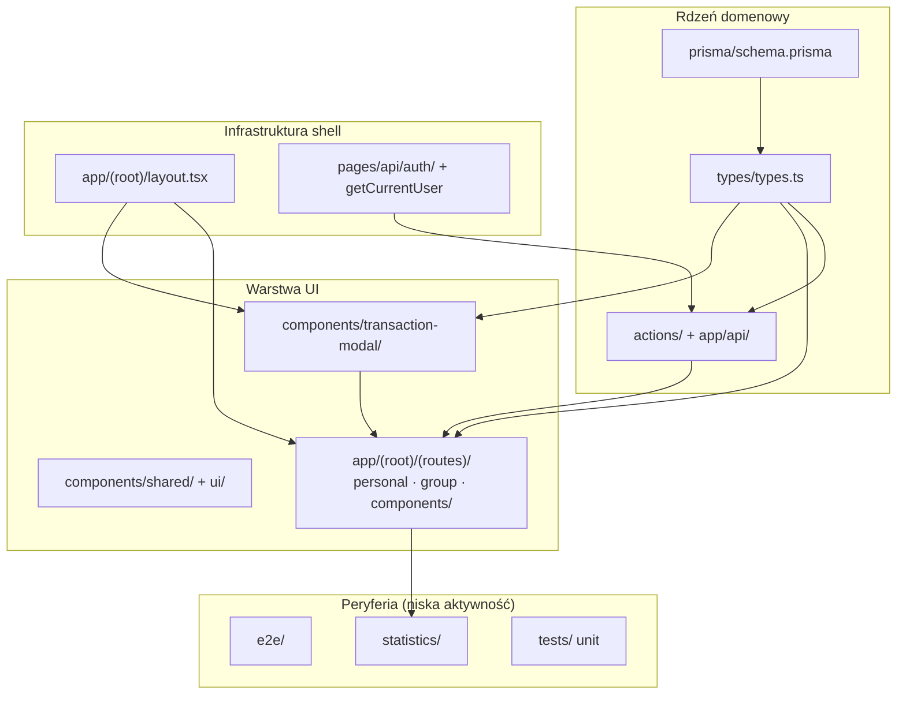
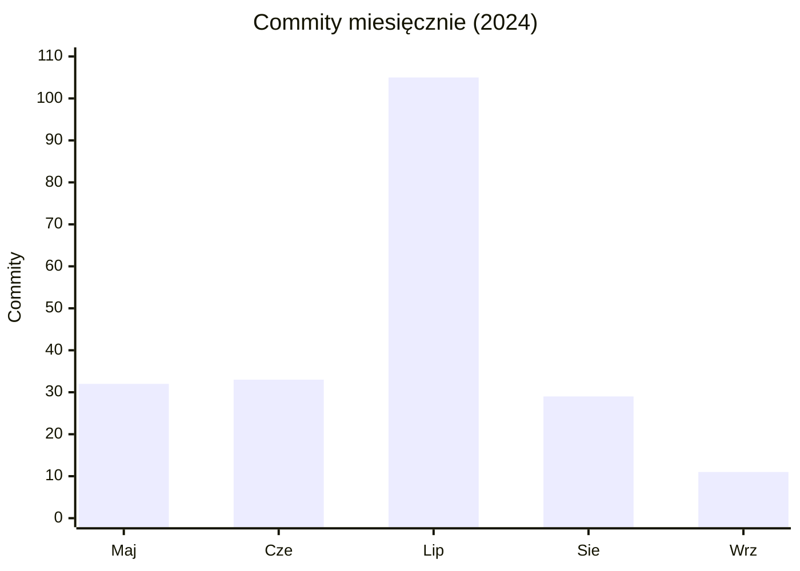

# Mapa repozytorium — isave

> Synteza: [`artifact-1-territory.md`](./artifact-1-territory.md) (git) · [`artifact-2-structure.md`](./artifact-2-structure.md) (dependency-cruiser) · [`artifact-3-contributors.md`](./artifact-3-contributors.md) (autorzy)  
> Cel: 15 minut czytania → wiesz gdzie żyje kod, co jest niebezpieczne, od czego zacząć.

---

## 1. TL;DR

**isave** to aplikacja Next.js do budżetów osobistych i grupowych — transakcje, modale CRUD, dashboard ze statystykami, rejestracja użytkowników i skanowanie paragonów przez AI. Cały aktywny rozwój mieści się w **maj–wrzesień 2024** (210 commitów); od września 2024 **brak commitów** (~21 miesięcy ciszy).

Praca historycznie skupiała się na **modałach transakcji** i **UI budżetu personal**, potem przesunęła się na **dashboard, auth/rejestrację, AI i testy E2E**. Najwięcej „bólu" przy wznowieniu prac: **huby typów i auth** (wysoki fan-in bez cykli), **edit-transaction** (odstaje od wzorca, trudny do unit-testów) oraz **dashboard bez żadnych testów** mimo szczytu aktywności w Q3.

Jedyny autor funkcjonalny: **Pawel Gnat** — brak rozproszonej wiedzy w zespole.



---

## 2. Teren

### Duża odpowiedzialność vs peryferia

| Strefa | Głębokość* | Aktywność git | Uwaga |
|--------|:----------:|:-------------:|-------|
| `components/transaction-modal/` | głęboka | 93 zmian | Wspólna logika CRUD — kotwica projektu |
| `app/(root)/(routes)/personal/` | głęboka | 76 | MVP Q2; pliki przeniesione do `components/table/`, `components/shared/` |
| `app/(root)/(routes)/components/` | średnia | 51 | **Dashboard** — nazwa folderu nie mówi „dashboard"; szczyt Q3 |
| `actions/` + `app/api/transaction/` | średnia | 45+45 | Server actions i REST równolegle |
| `types/` + `prisma/` | płytkie pliki, ogromny zasięg | 39 | 2 pliki, ale hub całego repo |
| `app/api/ai/` | płytkie | 23 | Poza TOP 10 folderów, w TOP 10 plików |
| `e2e/` | — | 25 | Faza Q3; personal/group CRUD |
| `app/(root)/(routes)/statistics/` | średnia | ~16 commitów** | Aktywność Q3, zero testów |

\*Głębokość = wiele plików współzmienianych vs kilka hubów.  
\*\*Z artifact-3 (dashboard + statistics łącznie).

### Gdzie struktura katalogów kłamie

- **`components/shared/actions-panel`** — „shared", ale importuje `transactions-context` (sprzężenie domenowe; **graf importów**).
- **`app/api/transaction/expense/`** — historyczna ścieżka; dziś `personal/expense/` i `group/` (**git rename**, artifact-1).
- **Personal budget** — `actions-panel`, `transaction-table` wyszły z `personal/components/` do `components/shared/` i `components/table/` (czerwiec–lipiec 2024).
- **`group-expenses-card.tsx`** — usunięty bez następcy; ostatnie commity lipiec–wrzesień 2024 (**git**).

### Aktywność w czasie



| Faza | Kiedy | Focus |
|------|-------|-------|
| Greenfield sprint | Q2 2024 | Personal budget, modale, schema Prisma, shadcn od zera |
| Productize & harden | Q3 2024 | Dashboard, auth/register, AI, E2E/unit, mobile polish |
| Cisza | Q4 2024 → dziś | 0 commitów |

Shift Q2→Q3: personal UI ↓ (MVP gotowy), dashboard ↑ 1%→14%, auth ↑, E2E ↑ 0%→9% (**git**, artifact-1).

---

## 3. Realne powiązania

### Warstwy — co graf mówi wprost

Model z dependency-cruiser (195 modułów, 668 krawędzi, **0 cykli**, **0 naruszeń** reguł warstwowych):

```
types → reducers → contexts → hooks → components → app/(routes)
                ↘ utils ↗              ↘ actions → lib/prisma
                              app/api → actions + utils + types
```

Graf obejmuje **TypeScript/JavaScript** w skonfigurowanych ścieżkach repo. **Nie obejmuje:** runtime Prisma (migracje, seed), konfiguracji deploy (Netlify/Vercel), zmiennych env, ani zachowania zewnętrznych API (OpenAI, email OAuth2) — tam coupling = **unknown** (poza repo).

### Couplingi — trzy źródła dowodu

| Sprzężenie | Typ | Źródło | Koszt zmiany |
|------------|-----|--------|--------------|
| `types/types.ts` ↔ personal, group, modale, AI, auth, reducery | ręczna współedycja | **git** (25 obszarów co-commit, 7.2 innych obszarów/commit) + **graf** (fan-in 27) | wysoki |
| `prisma/schema.prisma` ↔ feature commity | ręczna + **regeneracja** | **git** (27 obszarów co-commit); po zmianie schema → `prisma generate` odświeża `@prisma/client` (**regeneracja**, nie edycja ręczna) | wysoki (schema) / niski (klient) |
| `app/(root)/layout.tsx` ↔ nowe modale/contexty | ręczna | **git** (26 obszarów) + **graf** (montuje 3 modale + 3 contexty) | każdy nowy modal = dotyk shellu |
| `contexts/transactions-context` → `reducers/transaction-modal-reducer` → `types` | architektura OK | **graf** — jednokierunkowy łańcuch, brak cykli | niski w izolacji reducera |
| `edit-transaction.tsx` → 4× `actions/` bezpośrednio | anomalia wzorca | **graf** (jedyny modal tak robiący; reszta przez hooks) + **git** (refaktory context/reducer) | bardzo wysoki (unit test) |
| `getCurrentUser.ts` → `pages/api/auth/[...nextauth].ts` | ukryty coupling | **graf** (fan-in 37 na getCurrentUser) | wysoki przy migracji auth |
| `utils/formValidations.ts` ↔ modale + register API + transaction API | cross-warstwowy | **graf** (0 importów w utils, ale wielu konsumentów) + **git** | regresja bez testów |
| `package.json` ↔ każdy feature | chore/build | **git** (27 obszarów); lockfile wykluczony z rankingu | niski–średni |

### Brak cykli ≠ brak ryzyka

Graf jest **acykliczny, ale gwiaździsty** — zmiana w hubie rozchodzy się jednokierunkowo na wiele modułów; efekt podobny do cyklu, bez pętli importów (**graf**, artifact-2).

### Co zmienia się razem w commitach (git), a nie w importach

- **`package.json`** — każdy feature dodaje zależność; nie widać w grafie modułów aplikacji.
- **E2E specy** — współwystępują z modałami w commitach Q3, ale Playwright nie jest w grafie dependency-cruiser (**unknown** dla struktury test→prod).

---

## 4. Strefy ryzyka

| # | Obszar | Dlaczego |
|---|--------|----------|
| 1 | **`types/types.ts`** | Hub domenowy: fan-in 27 (**graf**) + średnio 7.2 innych obszarów na commit (**git**) — każda zmiana typu dotyka personal, group, modale, AI, auth |
| 2 | **`edit-transaction.tsx`** | 18 zależności, 4 bezpośrednie server actions, jedyny modal bez wzorca hooks (**graf**); brak unit testu; podgraf: [`edit-transaction-testability.svg`](./edit-transaction-testability.svg) |
| 3 | **Auth: `getCurrentUser` + `app/api/register/`** | Fan-in 37 na getCurrentUser; coupling do legacy `pages/api/auth/` (**graf**); Resend→Nodemailer+OAuth2, flow aktywacji (**git**) |
| 4 | **Dashboard / statystyki** | 51+ zmian w Q3 (**git**), **zero testów** unit i E2E (**artifact-2**); usunięty `group-expenses-card` bez następcy |
| 5 | **`utils/formValidations.ts`** | Współdzielony przez UI + 2 warstwy API (**graf**), brak testów mimo 3 warstw konsumentów |
| 6 | **`app/api/ai/`** | 23 commity, limity API, model 4o mini, blokada w dev (**git**); zależność od zewnętrznego OpenAI/OCR — **unknown** poza repo |

---

## 5. Kogo zapytać

W oknie 12 miesięcy **brak commitów od kogokolwiek** (artifact-3). Poniżej kontakty z pełnej historii aktywności (2024) — we wszystkich strefach **100% commitów: Pawel Gnat**; brak alternatywnych kontrybutorów.

| Strefa ryzyka | Kto | Dlaczego ten |
|---------------|-----|--------------|
| Schema + types | **Pawel Gnat** | 32 commity w obszarze; autor modelu od pierwszego commita; zna ewolucję personal→group→notifications→invite |
| Auth / register | **Pawel Gnat** | 23 commity; decyzje Nodemailer+OAuth2, aktywacja konta, inviteId |
| edit-transaction | **Pawel Gnat** | 10 commitów; refaktory context/reducer; ostatnia zmiana wrzesień 2024 — wie, czy coupling actions był świadomy |
| Dashboard / stats | **Pawel Gnat** | 16 commitów; wykresy, zamiana biblioteki chartów, intencja stron statistics |
| AI / paragony | **Pawel Gnat** | 23 commity; limity kosztów, wybór modelu, OCR bez daty |
| formValidations / utils | **Pawel Gnat** | autor cross-feature commitów łączących walidacje z modalami i API |

**Kolejność kontaktu przy brownfield:** schema/types → auth → edit-transaction → AI → dashboard (artifact-3).

---

## 6. Pierwszy dzień — co czytać (kolejność)

1. **`prisma/schema.prisma`** — encje personal/group, relacje, punkt wyjścia domeny (**git hub** + **regeneracja** klienta).
2. **`types/types.ts`** — kontrakt TS używany przez całe UI i API; czytaj z świadomością fan-in 27 (**graf**).
3. **`contexts/transactions-context.tsx`** + **`reducers/transaction-modal-reducer.ts`** — globalny stan modala; zdrowy łańcuch jednokierunkowy (**graf**).
4. **`app/(root)/layout.tsx`** — shell: navbar, providery, montowane modale; każda nowa funkcja UI prawdopodobnie tu trafi (**git** + **graf**).
5. **`components/transaction-modal/add-expense.tsx`** (lub `add-income.tsx`) — wzorzec „poprawny": hooks, nie actions (**graf**).
6. **`components/transaction-modal/edit-transaction.tsx`** — kontrast: anomalia do refaktoru; obok obejrzyj [`edit-transaction-testability.svg`](./edit-transaction-testability.svg).
7. **`app/(root)/(routes)/personal/page.tsx`** + **`personal/components/transactions.tsx`** — główny flow użytkownika (najwyższa aktywność Q2, **git**).
8. **`actions/getCurrentUser.ts`** — wejście w auth i blast radius 37 importerów (**graf**); czytaj razem z `pages/api/auth/[...nextauth].ts`.

Opcjonalnie po godzinie: **`e2e/personal-budget.spec.ts`** — jak projekt definiuje „działa" (CRUD przez modale, **git** Q3).

---

## 7. Ograniczenia

| Czego mapa **nie** mówi | Dlaczego |
|-------------------------|----------|
| Stan produkcyjny, deploy, sekrety env | Poza git i grafem modułów |
| Jakość UX, bugi runtime, wydajność | Mapa aktywności ≠ mapa jakości |
| Aktualność zewnętrznych API (OpenAI, NextAuth App Router) | 21+ miesięcy ciszy; **unknown** |
| Pełna historia plików bez `--follow` | 36 plików zmieniło ścieżkę; użyj mapy rename'ów w artifact-1 |
| Coupling testów do kodu produkcyjnego | Playwright/Vitest poza grafem dependency-cruiser |

**Okno czasowe:** analiza aktywności opiera się na **maj–wrzesień 2024** (jedyny okres z commitami). Żądane okno „12 miesięcy" (czerwiec 2025 → czerwiec 2026) zawiera **0 commitów** — mapa opisuje **ostatni rok aktywnego rozwoju**, nie ostatni rok kalendarzowy.

**Metody:** git log (terytorium, współzmiany, autorzy) · dependency-cruiser v16.10.4 (struktura, cykle, warstwy) · brak analizy runtime / bazy / CI poza wzmiankami w commit messages.

**Źródła szczegółowe:** [`artifact-1-territory.md`](./artifact-1-territory.md) · [`artifact-2-structure.md`](./artifact-2-structure.md) · [`artifact-3-contributors.md`](./artifact-3-contributors.md)
